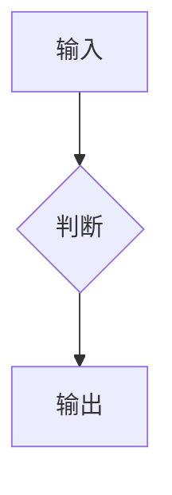

# API Doc Template

Use this structure for API reference pages. Adapt optional sections to function
complexity.

## Complexity Rules

| Function type | Signals                                                             | Required sections                                       | Optional sections                         |
| ------------- | ------------------------------------------------------------------- | ------------------------------------------------------- | ----------------------------------------- |
| Simple        | Single input, no config object, no thrown errors                    | Intro, examples, signature, params, return value, links | Runtime logic, performance, compatibility |
| Medium        | Multiple params, config object, edge behavior, possible errors      | All core sections, config table when needed             | Flow diagram, performance                 |
| Complex       | Generics, overloads, recursion, tree traversal, multi-mode behavior | All sections                                            | None unless genuinely irrelevant          |

Add these sections only when they are useful:

- Config object table: when the API accepts an options object.
- Generic constraints: when the signature includes meaningful generics.
- Runtime logic or Mermaid: when the function has branching, recursion, state
  transitions, traversal, or multi-step processing.
- Performance or compatibility: when complexity or runtime support affects usage.

## Page Structure

````markdown
---
title: {FunctionName}
description: {package} 的 {FunctionName} 函数，{一句话功能描述}
---

# {FunctionName}

{一句话功能描述}

## 示例

### 基本用法

```typescript
import { {functionName} } from '{packageName}'

{functionName}({typicalInput}) // => {expectedOutput}
```

### {场景}

{从测试用例提炼的场景}

## 签名

```typescript
{completeTypeSignature}
```

## 参数

| 参数   | 类型   | 描述          | 必需    |
| ------ | ------ | ------------- | ------- |
| {name} | {type} | {description} | {是/否} |

### {ConfigType}

| 字段    | 类型   | 描述          | 默认值    |
| ------- | ------ | ------------- | --------- |
| {field} | {type} | {description} | {default} |

## 返回值

- **类型**：`{ReturnType}`
- **说明**：{description}
- **特殊情况**：{edgeCases}

## 运行逻辑

{仅在有清晰流程、递归、状态转换或复杂分支时添加说明或 Mermaid 图}



## 注意事项

### 输入边界

{边界情况}

### 错误处理

{是否抛异常、返回错误值或降级}

### 性能考虑

- **时间复杂度**：{O(?)} — {说明}
- **空间复杂度**：{O(?)} — {说明}

### 兼容性

{运行时或 JavaScript 特性要求}

## 相关链接

- 源码：`packages/{pkg}/src/{path}`
- 测试：`packages/{pkg}/src/{path}.test.ts`
````

## Example Quality

- Extract examples from tests whenever possible.
- Include import statements with full package names.
- Prefer `// =>` output comments over `console.log`.
- Cover the basic path and at least one edge or advanced case for medium and
  complex APIs.
- Keep Mermaid diagrams focused on behavior that helps users understand the API;
  do not add diagrams for straight-line wrappers.
