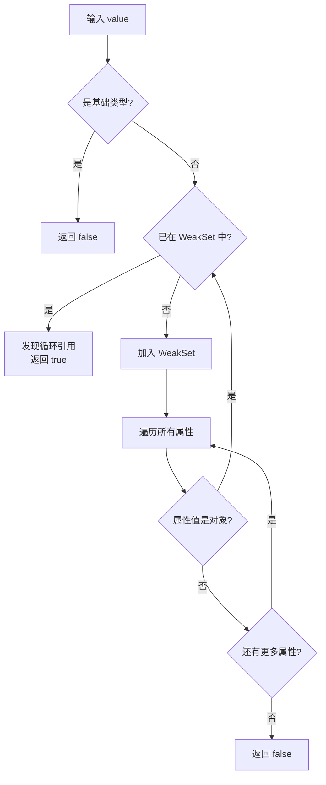

# API 文档模板

本文档定义 esdora 项目 API 参考文档的标准结构。生成文档时，根据函数的复杂度自适应填充各章节。

## 自适应规则

| 函数类型 | 特征 | 必填章节 | 可省略章节 |
|---------|------|---------|-----------|
| **简单函数** | 单参数、无配置、无异常、纯转换 | 简介、示例、签名、参数、返回值、相关链接 | 配置对象表、泛型约束、性能、兼容性、流程图 |
| **中等函数** | 多参数/有配置/有边界/可能抛异常 | 全部章节，但性能/兼容性/流程图可精简 | — |
| **复杂函数** | 泛型/递归/树操作/多种模式/有状态 | 全部章节，不可省略 | — |

判断依据：
- 有 `interface Options` 或对象参数 → 展开配置对象字段表
- 有 `<T extends ...>` → 添加泛型约束说明
- 源码中有 `throw` → 详细错误处理
- 涉及遍历/递归/大量数据处理 → 添加性能考虑 + 流程图
- 依赖现代 JS 特性（WeakSet、Map、Symbol 等）→ 添加兼容性
- 函数有清晰的执行步骤或状态转换 → 添加 Mermaid 流程图

## 文档结构

```markdown
---
title: {FunctionName}
description: {package} 的 {FunctionName} 函数，{一句话功能描述}
---

# {FunctionName}

{一句话功能描述}

## 示例

### 基本用法

```typescript
import { {functionName} } from '{packageName}'

{functionName}({典型输入}) // => {预期输出}
```

### {场景1}

{根据测试用例提炼的特定场景。复杂函数至少提供 2 个场景}

### {场景2}

{边界情况或高级用法}

## 签名

```typescript
{完整类型签名，含重载声明}
```

## 参数

| 参数 | 类型 | 描述 | 必需 |
|------|------|------|------|
| {name} | {type} | {desc} | {是/否} |

{如果参数包含配置对象，在此展开其字段}

### {ConfigType}

| 字段 | 类型 | 描述 | 默认值 |
|------|------|------|--------|
| {field} | {type} | {desc} | {default} |

## 返回值

- **类型**: `{ReturnType}`
- **说明**: {描述}
- **特殊情况**: {边界返回值说明}

{如果使用泛型，在此说明约束}

## 运行逻辑

{当函数有清晰的执行步骤、状态转换或数据流转时，使用 Mermaid 流程图描述}

```mermaid
{流程图类型：flowchart TD / graph LR / sequenceDiagram / stateDiagram}
{节点和边，描述函数的执行流程}
```

{用文字简要解释流程图的关键路径}

## 注意事项

### 输入边界

- {边界情况1}
- {边界情况2}

### 错误处理

- {是否抛异常 / 如何表达错误}

### 性能考虑

- **时间复杂度**: {O(?)} — {说明}
- **空间复杂度**: {O(?)} — {说明}

### 兼容性

- **环境要求**: {ES版本 / 运行时}

## 相关链接

- [源码]({source-url})
- [单元测试]({test-url})
```

## Mermaid 流程图规范

### 选择流程图类型

| 场景 | 推荐类型 | 示例 |
|------|---------|------|
| 执行步骤/分支判断 | `flowchart TD` | isCircular 的检测流程 |
| 数据转换/流转 | `flowchart LR` | toHex 的颜色转换 |
| 遍历过程 | `flowchart TD` | treeFilter 的 DFS/BFS |
| 状态变化 | `stateDiagram` | Promise 工具的状态流转 |
| 调用时序 | `sequenceDiagram` | 多函数协作场景 |

### 示例

**isCircular 检测流程**：



**treeFilter DFS 遍历**：

```mermaid
flowchart TD
    A[输入 tree 数组] --> B{遍历模式?}
    B -->|DFS| C[递归处理每个节点]
    B -->|BFS| D[使用队列逐层处理]
    C --> E{fn(node) === true?}
    D --> E
    E -->|是| F[保留节点<br/>递归处理 children]
    E -->|否| G[丢弃节点]
    F --> H[返回过滤后的树]
    G --> H
```

## 示例质量要求

1. **必须从测试用例提取**：确保示例可运行、输出准确
2. **使用 `// =>` 标注输出**：不使用 `console.log`
3. **包含 import 语句**：使用完整包名（如 `@esdora/kit`）
4. **覆盖核心场景**：基本用法 + 至少一个边界/高级场景
5. **渐进式**：从简单到复杂

## 输出路径

```
docs/packages/{package}/reference/{category}/{function-name}.md
```

- `{package}`: kit / color / date / biz
- `{category}`: 从源码路径推导，如 `src/is/` → `is`，`src/tree/` → `tree`
- `{function-name}`: kebab-case，如 `isCircular` → `is-circular`
