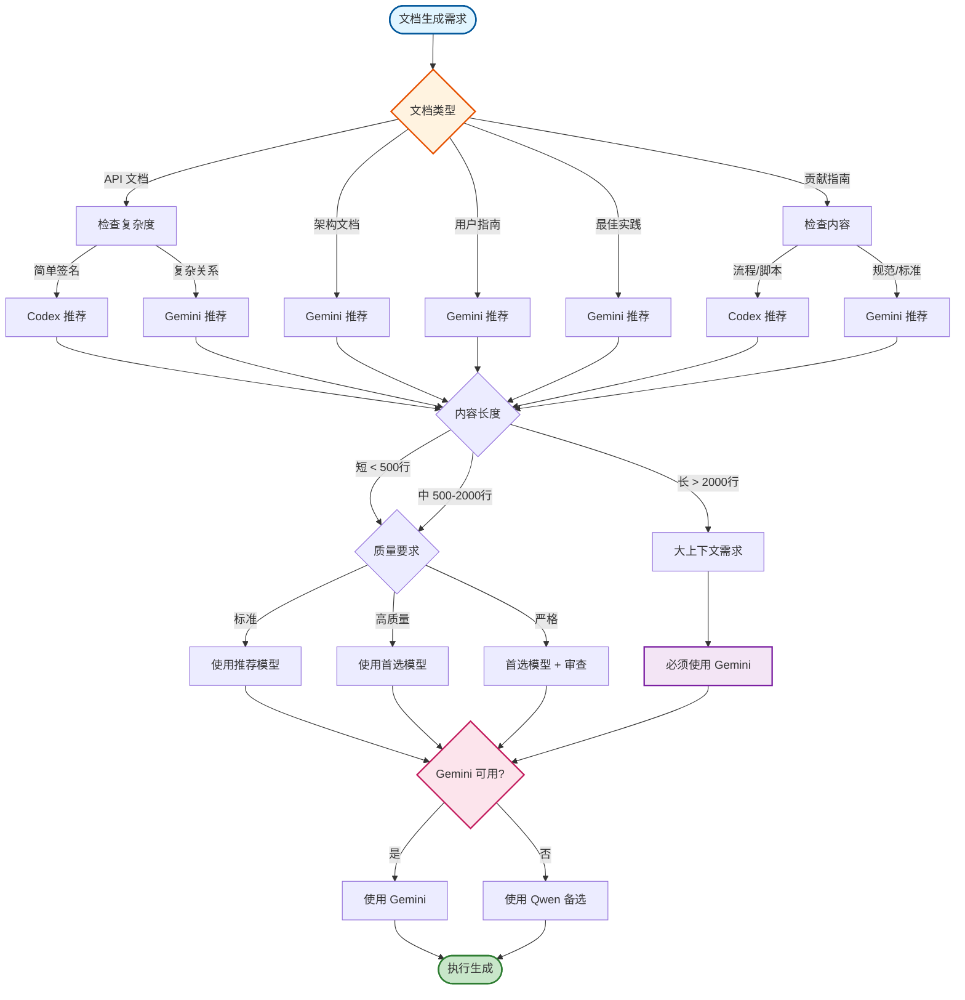

# AI 模型调度策略

本文档定义了 `Dora Pocket` 文档系统中 **AI 模型的调度策略和选择规则**，确保每类文档类型使用最合适的 AI 模型进行生成，以达到最佳的文档质量和生成效率。

## 模型能力矩阵

以下矩阵展示了 4 种 AI 模型在 4 个核心能力维度上的表现：

| AI 模型         | 分析能力   | 生成能力   | 上下文处理 | 处理速度 |
| --------------- | ---------- | ---------- | ---------- | -------- |
| **Claude Code** | ⭐⭐⭐⭐⭐ | ⭐⭐⭐⭐   | ⭐⭐⭐⭐   | ⭐⭐⭐⭐ |
| **Codex**       | ⭐⭐⭐     | ⭐⭐⭐⭐⭐ | ⭐⭐⭐     | ⭐⭐⭐⭐ |
| **Gemini**      | ⭐⭐⭐⭐⭐ | ⭐⭐⭐⭐   | ⭐⭐⭐⭐⭐ | ⭐⭐⭐   |
| **Qwen**        | ⭐⭐⭐⭐   | ⭐⭐⭐     | ⭐⭐⭐⭐   | ⭐⭐⭐⭐ |

### 模型版本详细说明

| 工具            | 模型系列 | 版本标识                                | 上下文窗口  | 主要特性                       | 最佳用途                             |
| --------------- | -------- | --------------------------------------- | ----------- | ------------------------------ | ------------------------------------ |
| **Claude Code** | Claude   | Sonnet 4.5 (claude-sonnet-4-5-20250929) | 200K tokens | 交互式开发、工具编排、复杂推理 | 当前会话编排、多工具协调、交互式任务 |
| **Codex**       | GPT      | 5.1 (默认)                              | Large       | 自主执行、数学推理             | 功能实现、bug 修复                   |
| **Codex**       | GPT      | 5.1-codex                               | Extended    | 扩展能力、复杂任务             | 高级实现、复杂功能开发               |
| **Codex**       | GPT      | 5.1-codex-mini                          | Large       | 轻量级、快速处理               | 简单任务、快速修复                   |
| **Gemini**      | Gemini   | 2.5-pro (默认)                          | 2M tokens   | 大上下文、模式识别             | 分析、架构审查                       |
| **Gemini**      | Gemini   | 2.5-flash                               | 1M tokens   | 快速处理、高效                 | 快速分析、文档生成                   |
| **Qwen**        | Qwen     | coder-model (默认)                      | Large       | 代码理解、备用方案             | 分析备用、代码审查                   |
| **Qwen**        | Qwen     | vision-model                            | Large       | 图像分析                       | 设计分析（少用）                     |

**使用说明**：

- **Claude Code**：用于当前交互会话、编排其他工具、复杂多步骤工作流
- **Codex**：用于自主代码实现和测试
- **Gemini**：用于分析和文档生成（首选）
- **Qwen**：当 Gemini 不可用时的备用方案
- 所有工具自动选择合适的模型；很少需要 `-m` 参数

### Claude Code

- **模型标识**: `claude-sonnet-4-5-20250929`
- **核心能力**:
  1. **交互式开发**: 支持实时对话和迭代式开发，适合复杂的多步骤任务
  2. **工具编排**: 可以协调和调用其他 AI 工具（Codex、Gemini、Qwen），实现多工具协作
  3. **复杂推理**: 擅长处理需要深度思考和多角度分析的任务
  4. **上下文理解**: 200K tokens 上下文窗口，能够理解大型代码库和复杂项目结构
- **典型用途**:
  - 当前会话的交互式开发和问题解决
  - 编排多个 AI 工具完成复杂工作流
  - 需要人工介入和决策的任务
  - 复杂的架构设计和技术决策讨论
- **优势**: 交互性强，可以实时调整策略，支持工具编排，适合需要人工监督的任务
- **限制**: 不支持完全自主执行模式，需要人工确认关键步骤

### Codex

- **模型标识**: `gpt-5.1-codex`
- **核心能力**:
  1. **代码生成**: 精确生成 TypeScript 类型签名、函数实现和测试代码
  2. **自主开发**: 支持 `--full-auto exec` 模式，可自动化执行多步骤开发任务
  3. **测试生成**: 基于源码和需求生成高质量 Vitest 单元测试
- **典型用途**:
  - API 文档中的函数签名和参数说明生成
  - 贡献指南中的工作流程和脚本示例生成
  - 组件实现和代码示例创建
- **优势**: 代码生成质量高，理解 TypeScript 类型系统深入，支持会话恢复 (`resume --last`)
- **限制**: 分析大型架构时不如 Gemini 全面，上下文窗口相对较小

### Gemini

- **模型标识**: `gemini-2.5-pro`
- **核心能力**:
  1. **大上下文分析**: 支持超大文件和跨模块依赖分析
  2. **模式识别**: 从代码库中识别设计模式、架构风格和最佳实践
  3. **架构审查**: 评估系统设计、技术选型和组件关系
- **典型用途**:
  - 架构文档的系统设计说明和技术选型论证
  - 用户指南的步骤化内容组织和问题导向结构
  - 最佳实践的模式提取和对比分析
- **优势**: 分析深度和广度优秀，大上下文处理能力强，文档组织能力突出
- **限制**: 生成速度相对较慢，不支持自主开发模式

### Qwen

- **模型标识**: `qwen-coder`
- **核心能力**:
  1. **备用分析**: 当 Gemini 不可用时提供可靠的分析能力
  2. **代码审查**: 识别代码质量问题和潜在改进点
  3. **文档生成**: 生成结构化的技术文档和说明
- **典型用途**:
  - Gemini 的备选方案，用于所有分析和文档生成任务
  - 代码审查和质量评估
  - 中等复杂度的文档撰写
- **优势**: 接口与 Gemini 一致，切换成本低，确保服务连续性
- **限制**: 分析深度略逊于 Gemini，不适合超大上下文场景

## 选择维度

AI 模型的选择基于 **4 个核心维度**的综合评估：

### 1. 文档类型

文档类型是模型选择的**首要维度**，不同类型的文档对 AI 能力的需求差异显著。

- **API 文档**: 需要精确的类型签名和参数说明 → **优先 Codex**
- **架构文档**: 需要大上下文分析和架构理解 → **优先 Gemini**
- **用户指南**: 需要示例驱动和步骤化组织 → **优先 Gemini**
- **最佳实践**: 需要模式识别和对比分析 → **优先 Gemini**
- **贡献指南**: 需要流程生成和规范说明 → **优先 Codex**

### 2. 任务复杂度

任务复杂度影响对模型分析能力和上下文处理的要求。

- **简单任务** (单文件、单函数): Codex 或 Qwen 均可
- **中等任务** (跨文件、多组件): Gemini (首选) 或 Qwen (备选)
- **复杂任务** (跨模块、架构级): Gemini (必需)

### 3. 内容长度

文档内容长度决定对模型上下文窗口的需求。

- **短文档** (< 500 行): 所有模型均可
- **中等文档** (500-2000 行): Gemini (首选) 或 Codex
- **长文档** (> 2000 行): Gemini (必需，大上下文能力)

### 4. 质量要求

文档质量要求影响对模型生成能力和准确性的期望。

- **标准质量**: Qwen 或 Codex
- **高质量**: Gemini (分析类) 或 Codex (代码类)
- **严格质量**: 使用首选模型 + 人工审查

## 决策流程

以下 Mermaid 流程图展示了从文档类型到模型选择的完整决策路径：



## 文档类型模型推荐

以下为 5 类文档类型的详细模型推荐方案：

### 1. API 文档

**推荐模型**: **Codex** (`gpt-5.1-codex`)
**备选模型**: Gemini (`gemini-2.5-pro`)

**选择理由**:

- API 文档核心是**精确的函数签名、参数类型和返回值说明**，Codex 在代码生成和类型推断上表现最佳
- Codex 能够基于源码和单元测试自动生成准确的参数表格和边界情况说明
- 对于简单的单函数文档，Codex 生成速度快，质量稳定

**备选场景**:

- 当 API 涉及复杂的跨模块依赖或需要深度架构理解时，使用 **Gemini**
- 当需要分析 API 设计模式或生成最佳实践建议时，使用 **Gemini**

**典型文件**:

- `docs/packages/kit/reference/is/is-circular.md`
- `docs/packages/color/reference/conversion/to-hex.md`

**配置示例**:

```bash
# 使用 Codex 生成 API 文档
codex -C packages/kit --full-auto exec "
PURPOSE: 为 isCircular 函数生成 API 文档
TASK: 基于源码和测试生成完整的 Markdown 文档
MODE: auto
CONTEXT: @src/is/is-circular/**/* @tests/is/is-circular.test.ts
EXPECTED: 符合 api-template.md 规范的 API 文档
RULES: \$(cat ~/.claude/workflows/cli-templates/prompts/development/02-implement-feature.txt) | 遵循 L1+L2+L3 规范 | auto=FULL operations
" --skip-git-repo-check -s danger-full-access
```

### 2. 架构文档

**推荐模型**: **Gemini** (`gemini-2.5-pro`)
**备选模型**: Qwen (`qwen-coder`)

**选择理由**:

- 架构文档需要**大上下文分析能力**，理解跨模块的组件关系、数据流和技术选型
- Gemini 擅长模式识别和架构审查，能够从代码库中提取设计原则和组件依赖
- 架构文档通常内容较长且需要深度思考，Gemini 的分析深度优势明显

**备选场景**:

- 当 Gemini 不可用时，使用 **Qwen** 作为备选
- 对于小型模块的架构文档，Qwen 的分析能力足够

**典型文件**:

- `docs/contributing/documentation/architecture.md`
- 各模块的设计文档（如 `@esdora/biz` 的架构说明）

**配置示例**:

```bash
# 使用 Gemini 生成架构文档
cd docs/contributing/documentation && gemini -p "
PURPOSE: 生成文档规范体系的架构文档
TASK:
• 分析 3 层规范体系的设计原则
• 绘制架构可视化图表 (Mermaid)
• 说明组件关系和继承规则
MODE: write
CONTEXT: @**/* @../../../packages/*/src/**/* | Memory: 基于已有 glossary.md 定义的 5 类文档类型
EXPECTED: 完整的架构文档，包含 Mermaid 图、设计原则和技术选型论证
RULES: \$(cat ~/.claude/workflows/cli-templates/prompts/analysis/02-review-architecture.txt) | 遵循 L1+L2 架构文档规范 | write=CREATE/MODIFY/DELETE
" --approval-mode yolo
```

### 3. 用户指南

**推荐模型**: **Gemini** (`gemini-2.5-pro`)
**备选模型**: Codex (`gpt-5.1-codex`)

**选择理由**:

- 用户指南需要**示例驱动**和**步骤化组织**，Gemini 在内容组织和结构化方面表现优秀
- Gemini 能够从用户视角出发，生成清晰的问题导向内容和实用示例
- 用户指南通常涉及多个模块的使用场景，需要大上下文理解

**备选场景**:

- 当用户指南侧重于代码示例和脚本生成时，使用 **Codex**
- 对于简单的操作步骤说明，Codex 生成速度更快

**典型文件**:

- 快速上手指南
- 安装和配置指南
- 常见问题解答 (FAQ)

**配置示例**:

```bash
# 使用 Gemini 生成用户指南
cd docs && gemini -p "
PURPOSE: 为 @esdora/kit 创建快速上手指南
TASK:
• 设计 3-5 个常用场景的使用示例
• 组织步骤化的安装和配置流程
• 提供常见问题的解决方案
MODE: write
CONTEXT: @packages/kit/**/* @README.md | Memory: 用户中心原则，示例驱动的文档哲学
EXPECTED: 完整的用户指南，包含步骤说明、代码示例和预期结果验证
RULES: \$(cat ~/.claude/workflows/cli-templates/prompts/development/02-implement-component-ui.txt) | 遵循 L1+L2 用户指南规范 | write=CREATE/MODIFY/DELETE
" --approval-mode yolo
```

### 4. 最佳实践

**推荐模型**: **Gemini** (`gemini-2.5-pro`)
**备选模型**: Qwen (`qwen-coder`)

**选择理由**:

- 最佳实践文档需要**模式识别**和**对比分析**，Gemini 擅长从代码库中提取设计模式和经验教训
- Gemini 能够生成"问题-原则-方案"结构的深度内容，说明"为什么"而非仅"怎么做"
- 最佳实践需要跨模块的模式综合，Gemini 的大上下文能力至关重要

**备选场景**:

- 当 Gemini 不可用时，使用 **Qwen** 作为备选
- 对于中等复杂度的实践总结，Qwen 的分析能力足够

**典型文件**:

- 设计模式指南
- 代码规范和风格指南
- 性能优化最佳实践

**配置示例**:

```bash
# 使用 Gemini 生成最佳实践
cd docs && gemini -p "
PURPOSE: 总结 Dora Pocket 项目的代码组织最佳实践
TASK:
• 分析现有包的模块组织模式 (packages/kit/src/, packages/color/src/)
• 提取可复用的设计原则和实践方法
• 生成好/坏实践的对比代码示例
MODE: write
CONTEXT: @packages/*/src/**/* @CLAUDE.md | Memory: Monorepo 分类组织模式，零依赖原则
EXPECTED: 最佳实践文档，采用问题-原则-方案结构，包含对比分析和适用场景说明
RULES: \$(cat ~/.claude/workflows/cli-templates/prompts/analysis/02-analyze-code-patterns.txt) | 遵循 L1+L2 最佳实践规范 | write=CREATE/MODIFY/DELETE
" --approval-mode yolo
```

### 5. 贡献指南

**推荐模型**: **Codex** (`gpt-5.1-codex`)
**备选模型**: Gemini (`gemini-2.5-pro`)

**选择理由**:

- 贡献指南包含**工作流程、脚本示例和自动化配置**，Codex 在生成可执行代码和流程方面优势明显
- Codex 能够基于现有 CI/CD 配置和开发脚本生成准确的贡献流程说明
- 贡献指南需要大量的命令行示例和配置代码，Codex 生成质量高

**备选场景**:

- 当贡献指南侧重于规范说明和协作指南时，使用 **Gemini**
- 当需要深度分析开发流程和优化建议时，使用 **Gemini**

**典型文件**:

- `CONTRIBUTING.md`
- 提交规范和 PR 模板
- 开发环境配置指南

**配置示例**:

```bash
# 使用 Codex 生成贡献指南
codex -C . --full-auto exec "
PURPOSE: 生成 Dora Pocket 项目的贡献指南
TASK:
• 提取现有的工作流程 (Git 分支策略、PR 流程)
• 生成开发环境配置步骤和脚本示例
• 说明代码风格要求和测试覆盖率标准
MODE: auto
CONTEXT: @.github/**/* @package.json @CLAUDE.md | Memory: Monorepo 结构，pnpm + Turbo 工具链
EXPECTED: 完整的贡献指南，包含工作流程图、配置脚本和规范要求
RULES: \$(cat ~/.claude/workflows/cli-templates/prompts/development/02-implement-feature.txt) | 遵循 L1+L2 贡献指南规范 | auto=FULL operations
" --skip-git-repo-check -s danger-full-access
```

## 模型调度最佳实践

### 1. 混合调度模式（推荐）

对于复杂的 API 文档，推荐使用**混合调度模式**，充分发挥各模型优势：

```
Claude Code（调度层）
    ↓
Gemini 2.5-pro（分析层）→ 结构化分析报告 → Codex 5.1（生成层）
    ↓
Claude Code（验证层）
```

**工作流程**：

1. **Claude 调度**：接收任务，解析参数，协调执行
2. **Gemini 分析**：利用 2M 上下文深度理解源码，输出 JSON 格式分析报告
3. **Codex 生成**：基于分析报告生成高质量文档和代码示例
4. **Claude 验证**：检查质量，输出最终结果

**混合模式优势**：

| 维度         | 单一模型 | 混合模式   |
| ------------ | -------- | ---------- |
| 类型准确性   | ⭐⭐⭐⭐ | ⭐⭐⭐⭐⭐ |
| 代码示例质量 | ⭐⭐⭐⭐ | ⭐⭐⭐⭐⭐ |
| 上下文理解   | ⭐⭐⭐   | ⭐⭐⭐⭐⭐ |
| 边界情况覆盖 | ⭐⭐⭐⭐ | ⭐⭐⭐⭐⭐ |

**使用方式**：

```bash
/generate-docs --files "packages/kit/src/is/is-circular/index.ts" --type api --mode hybrid
```

### 2. 优先使用推荐模型

始终优先使用每类文档类型的**推荐模型**，只有在以下情况下才考虑备选：

- 推荐模型不可用或响应超时
- 任务特征明显偏离典型场景（如 API 文档需要深度架构分析）
- 质量要求允许使用性能更快的备选模型

### 3. 遵循 Gemini → Qwen 备选链

对于所有**分析和文档生成任务**，遵循以下备选链：

```
Gemini (首选) → Qwen (备选) → 人工生成 (最后手段)
```

Qwen 与 Gemini 接口一致，切换成本低，确保服务连续性。

### 4. Codex 会话管理

利用 Codex 的**会话恢复功能** (`resume --last`) 优化多任务生成：

- **第一个任务**: 使用完整的标准提示词模板建立上下文
- **后续任务**: 使用简短描述 + `resume --last` 继承上下文

示例：

```bash
# 第一个任务 - 建立完整上下文
codex -C packages/kit --full-auto exec "
PURPOSE: 生成 is-circular.md API 文档
TASK: 基于源码和测试生成完整文档
MODE: auto
CONTEXT: @src/is/is-circular/**/*
EXPECTED: 符合 api-template.md 规范的文档
RULES: 遵循 L1+L2+L3 规范 | auto=FULL operations
" --skip-git-repo-check -s danger-full-access

# 第二个任务 - 继承上下文
codex --full-auto exec "为 is-empty.md 生成类似文档" resume --last --skip-git-repo-check -s danger-full-access
```

### 5. 质量验证与迭代

生成文档后，必须进行质量验证：

1. **自动验证**: 使用 `quality-checklist.md` 中的检查清单（待创建）
2. **人工审查**: 检查内容准确性、示例可运行性、术语一致性
3. **迭代优化**: 基于验证结果重新生成或手动修正

### 6. 模型性能监控

定期评估各模型在不同文档类型上的表现：

- **生成质量**: 准确性、完整性、一致性
- **生成速度**: 平均耗时、超时率
- **成本效益**: Token 消耗、API 调用次数

根据监控结果调整模型推荐和备选策略。

## 配置参考

### Gemini 配置

```bash
# 标准分析模式 (默认)
gemini -p "prompt"

# 写入模式 (生成文档)
gemini -p "prompt" --approval-mode yolo

# 多目录上下文
gemini -p "CONTEXT: @**/* @../shared/**/*" --include-directories ../shared
```

### Qwen 配置

```bash
# 与 Gemini 接口完全一致
qwen -p "prompt"
qwen -p "prompt" --approval-mode yolo
```

### Codex 配置

```bash
# 自主开发模式
codex -C path --full-auto exec "prompt" --skip-git-repo-check -s danger-full-access

# 会话恢复
codex --full-auto exec "prompt" resume --last --skip-git-repo-check -s danger-full-access

# 附加图像
codex -C path -i design.png --full-auto exec "prompt" --skip-git-repo-check -s danger-full-access
```

## 相关文档

- [术语表](./glossary.md) - AI 模型定义和文档类型分类
- [文档规范体系架构](./architecture.md) - 3 层规范体系设计
- [API 文档模板](./api-template.md) - API 文档模板

## 版本历史

- **v1.1** (2025-11-24): 添加 Claude Code 介绍和详细模型版本说明，新增混合调度模式（Gemini 分析 + Codex 生成）
- **v1.0** (2025-11-19): 初始版本，建立 3 种模型能力矩阵、决策流程和 5 类文档类型推荐方案
