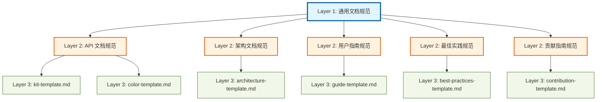
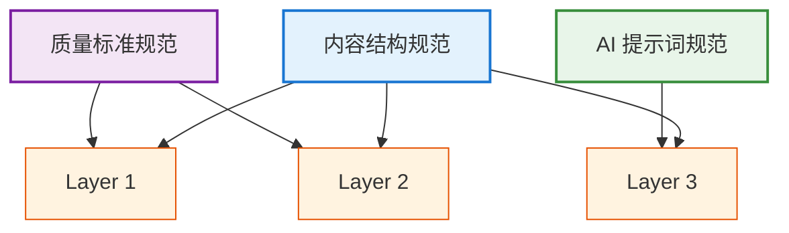

# 文档规范体系架构

本文档描述了 `Dora Pocket` 文档系统的**三层规范体系**架构设计，旨在通过分层继承的方式，确保文档的一致性、可扩展性和质量标准。

## 架构概述

我们的文档规范体系采用**分层继承设计**，从通用规范到具体模板逐层细化：

- **Layer 1 (L1)**: 通用文档规范层 — 所有文档共享的基础规范
- **Layer 2 (L2)**: 文档类型特定规范层 — 5 类文档类型各自的特定规范
- **Layer 3 (L3)**: 具体模板层 — 每类文档的可执行模板实现

### 架构可视化



### 继承关系原则

- **L3 继承 L2**: 具体模板实现类型特定规范 + 通用规范
- **L2 继承 L1**: 类型特定规范扩展通用规范
- **单向依赖**: 上层依赖下层，下层独立于上层

## 文件布局

所有文档规范文件统一存放在 `docs/contributing/documentation/` 目录：

```
docs/contributing/documentation/
├── glossary.md                    # 术语表 (已完成)
├── architecture.md                # 本文档 - 架构设计
├── ai-model-strategy.md           # AI 模型调度策略 (待创建)
├── quality-checklist.md           # 质量检查清单 (待创建)
├── index.md                       # 使用指引索引 (待创建)
├── usage-guide.md                 # 文档规范使用指南 (待创建)
├── overview.md                    # 总览 (已完成)
├── kit-template.md                # Layer 3: Kit API 文档模板 (已完成)
├── color-template.md              # Layer 3: Color API 文档模板 (待创建)
├── architecture-template.md       # Layer 3: 架构文档模板 (待创建)
├── guide-template.md              # Layer 3: 用户指南模板 (待创建)
├── best-practices-template.md     # Layer 3: 最佳实践模板 (待创建)
└── contribution-template.md       # Layer 3: 贡献指南模板 (待创建)
```

## Layer 1: 通用文档规范层

### 定义

适用于**所有文档类型**的基础规范，确保项目文档的整体一致性和专业性。

### 规范内容

#### 1. Frontmatter 元数据

所有 Markdown 文档必须包含 YAML 格式的 frontmatter：

```yaml
---
title: 文档标题
description: 文档详细描述，应完整说明页面内容和用途
---
```

**必需字段**:
- `title`: 简短明确的页面标题
- `description`: 完整的功能说明，包含来源和用途

**可选扩展字段**:
- `category`: 文档分类 (`API` | `架构` | `指南` | `实践` | `贡献`)
- `ai_model`: 生成该文档的 AI 模型 (`Codex` | `Gemini` | `Qwen`)

#### 2. 标题结构层次

严格遵循 Markdown 标题层级：

- **一级标题 (`#`)**: 每个文档仅有 1 个，作为页面主标题
- **二级标题 (`##`)**: 主要章节
- **三级标题 (`###`)**: 子章节
- **禁止跳级**: 不允许从 `#` 直接跳到 `###`

#### 3. 语言规范

- **主语言**: 简体中文
- **专业术语**: 必须参考 [术语表](./glossary.md) 使用统一命名
- **代码注释**: 可使用英文，但输出说明使用中文

#### 4. 链接格式

- **内部链接**: 使用相对路径 Markdown 语法
  ```markdown
  [术语表](./glossary.md)
  [Kit 模板](./kit-template.md)
  ```
- **外部链接**: 使用完整 URL
  ```markdown
  [VitePress 官方文档](https://vitepress.dev/)
  ```
- **源码链接**: 使用相对路径指向仓库内文件
  ```markdown
  - 源码: `packages/kit/src/is/is-circular/index.ts`
  ```

#### 5. 代码示例格式

- **语言标注**: 所有代码块必须标注语言
  ````markdown
  ```typescript
  import { isCircular } from '@esdora/kit'
  ```
  ````
- **输出注释**: 使用 `// =>` 行内注释展示输出结果
  ```typescript
  isCircular(obj) // => true
  ```
- **完整性**: 示例应可独立运行，包含必要的 import 语句

#### 6. 注意事项与边界情况

所有文档应包含 `## 注意事项与边界情况` 章节（或类似命名），说明：

- 特殊输入处理
- 已知限制
- 性能考虑
- 兼容性说明

## Layer 2: 文档类型特定规范层

### 定义

在 **Layer 1 通用规范**基础上，为 5 类文档类型各自定义的**特定规范扩展**。

### 类型 1: API 文档规范

**继承**: Layer 1 通用规范
**适用范围**: 函数、类、接口等编程接口文档
**典型文件**: `@esdora/kit` 函数文档、`@esdora/color` 函数文档

#### 特定规范

1. **签名与说明章节**
   - 章节名称: `## 签名与说明`
   - 内容要求:
     - 完整的函数签名（TypeScript 类型）
     - 参数说明（名称、类型、描述）
     - 返回值类型和说明
     - 泛型参数说明（如适用）

2. **参数表格格式**
   - 使用 Markdown 表格展示参数
   - 列: 参数名 | 类型 | 描述 | 必需/可选
   - 示例:
     ```markdown
     | 参数 | 类型 | 描述 | 必需 |
     |------|------|------|------|
     | obj  | any  | 待检测对象 | 是 |
     ```

3. **示例优先原则**
   - `## 示例` 章节必须在 `## 签名与说明` 之前
   - 至少包含 1 个基本用法示例
   - 复杂 API 应包含多个场景示例

### 类型 2: 架构文档规范

**继承**: Layer 1 通用规范
**适用范围**: 系统设计、技术选型、架构决策文档
**典型文件**: `ARCHITECTURE.md`、模块设计文档

#### 特定规范

1. **架构可视化要求**
   - 必须包含架构图（推荐使用 Mermaid）
   - 图表类型: `graph`、`flowchart`、`sequenceDiagram` 等
   - 图表说明: 每个图表后必须有文字解释

2. **设计原则章节**
   - 章节名称: `## 设计原则` 或 `## 核心理念`
   - 说明架构选择的原因和权衡

3. **组件关系说明**
   - 明确模块/组件之间的依赖关系
   - 数据流向和交互方式
   - 关键接口定义

4. **技术选型论证**
   - 为什么选择某技术栈
   - 考虑的替代方案
   - 已知的限制和风险

### 类型 3: 用户指南规范

**继承**: Layer 1 通用规范
**适用范围**: 面向最终用户的使用说明和操作手册
**典型文件**: 快速上手、安装指南、常见问题解答

#### 特定规范

1. **步骤化组织**
   - 使用有序列表或分步骤章节
   - 每个步骤清晰独立
   - 包含预期结果验证

2. **问题导向结构**
   - 以用户问题为章节标题
   - 提供直接可行的解决方案
   - 包含常见错误和排查

3. **实用示例要求**
   - 示例必须贴近实际使用场景
   - 完整可运行，包含完整上下文
   - 解释关键步骤的作用

### 类型 4: 最佳实践规范

**继承**: Layer 1 通用规范
**适用范围**: 总结经验教训和推荐做法的深度文章
**典型文件**: 设计模式、代码规范、性能优化指南

#### 特定规范

1. **问题-原则-方案结构**
   - **问题**: 明确要解决的痛点
   - **原则**: 阐述核心思想和理念
   - **方案**: 提供具体实践方法

2. **对比分析**
   - 好的实践 vs 不好的实践
   - 使用对比代码示例
   - 说明各自的影响和后果

3. **适用场景说明**
   - 明确最佳实践的适用边界
   - 不适用的场景和例外情况
   - 可能的替代方案

4. **深度和广度平衡**
   - 不仅是"怎么做"，更要说明"为什么"
   - 引用权威资料或社区共识
   - 鼓励批判性思考

### 类型 5: 贡献指南规范

**继承**: Layer 1 通用规范
**适用范围**: 指导外部贡献者参与项目的规范文档
**典型文件**: `CONTRIBUTING.md`、提交规范、文档编写指南

#### 特定规范

1. **工作流程说明**
   - 贡献流程的完整步骤
   - 分支策略和命名规范
   - 提交和 PR 要求

2. **规范和标准**
   - 代码风格要求
   - 测试覆盖率要求
   - 文档更新要求

3. **协作指南**
   - Issue 模板和标签使用
   - Code Review 流程
   - 沟通渠道和礼仪

## Layer 3: 具体模板层

### 定义

为每类文档类型提供的**可执行模板实现**，包含完整的结构、示例和 AI 生成提示词。

### 模板清单

| 文档类型 | 模板文件 | 状态 | 继承规范 |
|---------|---------|------|---------|
| API 文档 | `kit-template.md` | ✅ 已完成 | L1 + L2 (API) |
| API 文档 | `color-template.md` | 📋 待创建 | L1 + L2 (API) |
| 架构文档 | `architecture-template.md` | 📋 待创建 | L1 + L2 (架构) |
| 用户指南 | `guide-template.md` | 📋 待创建 | L1 + L2 (指南) |
| 最佳实践 | `best-practices-template.md` | 📋 待创建 | L1 + L2 (实践) |
| 贡献指南 | `contribution-template.md` | 📋 待创建 | L1 + L2 (贡献) |

### 模板内容要求

每个 Layer 3 模板文件必须包含：

1. **Frontmatter 元数据**
   ```yaml
   ---
   title: [文档类型]模板
   description: [用途说明和适用范围]
   ---
   ```

2. **文档结构模板**
   - 完整的章节框架
   - Markdown 格式示例
   - 必需和可选章节说明

3. **AI 生成提示词**（如适用）
   - 上下文与角色定义
   - 任务说明
   - 输入要求
   - 输出格式规范

4. **核心指令与规范**
   - 继承的 L1 和 L2 规范引用
   - 模板特定的注意事项
   - 质量检查要点

## 继承示例

以下展示 5 类文档类型从 L1 到 L3 的完整继承路径：

### 示例 1: API 文档继承路径

```
L1 通用规范
├─ Frontmatter (title, description)
├─ 标题结构 (# → ## → ###)
├─ 语言 (简体中文)
├─ 链接格式
├─ 代码示例格式 (// => 行内注释)
└─ 注意事项章节

    ↓ 继承并扩展

L2 API 文档规范
├─ L1 所有规范
├─ 签名与说明章节
├─ 参数表格格式
└─ 示例优先原则

    ↓ 继承并实现

L3 kit-template.md
├─ L1 + L2 所有规范
├─ 完整的 Markdown 结构模板
├─ AI 生成提示词
└─ 针对 @esdora/kit 的特定指令
```

### 示例 2: 架构文档继承路径

```
L1 通用规范
└─ (6 个通用规范)

    ↓

L2 架构文档规范
├─ L1 所有规范
├─ 架构可视化要求 (Mermaid)
├─ 设计原则章节
├─ 组件关系说明
└─ 技术选型论证

    ↓

L3 architecture-template.md (待创建)
├─ L1 + L2 所有规范
├─ 架构文档 Markdown 结构模板
├─ Mermaid 图表示例
└─ 架构文档 AI 生成提示词
```

### 示例 3: 用户指南继承路径

```
L1 通用规范
└─ (6 个通用规范)

    ↓

L2 用户指南规范
├─ L1 所有规范
├─ 步骤化组织
├─ 问题导向结构
└─ 实用示例要求

    ↓

L3 guide-template.md (待创建)
├─ L1 + L2 所有规范
├─ 用户指南 Markdown 结构模板
├─ 步骤化内容示例
└─ 用户指南 AI 生成提示词
```

### 示例 4: 最佳实践继承路径

```
L1 通用规范
└─ (6 个通用规范)

    ↓

L2 最佳实践规范
├─ L1 所有规范
├─ 问题-原则-方案结构
├─ 对比分析
├─ 适用场景说明
└─ 深度和广度平衡

    ↓

L3 best-practices-template.md (待创建)
├─ L1 + L2 所有规范
├─ 最佳实践 Markdown 结构模板
├─ 对比代码示例格式
└─ 最佳实践 AI 生成提示词
```

### 示例 5: 贡献指南继承路径

```
L1 通用规范
└─ (6 个通用规范)

    ↓

L2 贡献指南规范
├─ L1 所有规范
├─ 工作流程说明
├─ 规范和标准
└─ 协作指南

    ↓

L3 contribution-template.md (待创建)
├─ L1 + L2 所有规范
├─ 贡献指南 Markdown 结构模板
├─ 工作流程图示例
└─ 贡献指南内容规范
```

## 规范覆盖范围

### 内容结构规范

- **覆盖层级**: L1 + L2 + L3 (所有层)
- **作用**: 定义文档的章节组织、标题层次和内容顺序
- **示例**: Frontmatter 要求、标题结构、章节命名

### 质量标准规范

- **覆盖层级**: L1 + L2
- **作用**: 确保文档的完整性、准确性和专业性
- **示例**: 必需章节、内容完整性、术语一致性

### AI 模型提示词规范

- **覆盖层级**: L3 (仅模板层)
- **作用**: 为 AI 模型生成文档提供标准化提示词
- **示例**: kit-template.md 中的完整 AI 提示词

### 规范关系图



## 相关文档

- [术语表](./glossary.md) - 核心术语和命名规范
- [文档编写指南：总览](./overview.md) - 文档哲学和入口
- [Kit 工具函数模板](./kit-template.md) - Layer 3 API 文档模板示例
- [AI 模型调度策略](./ai-model-strategy.md) - AI 模型选择和使用规范 (待创建)
- [质量检查清单](./quality-checklist.md) - 文档质量验证标准 (待创建)

## 版本历史

- **v1.0** (2025-11-19): 初始版本，建立 3 层规范体系架构
