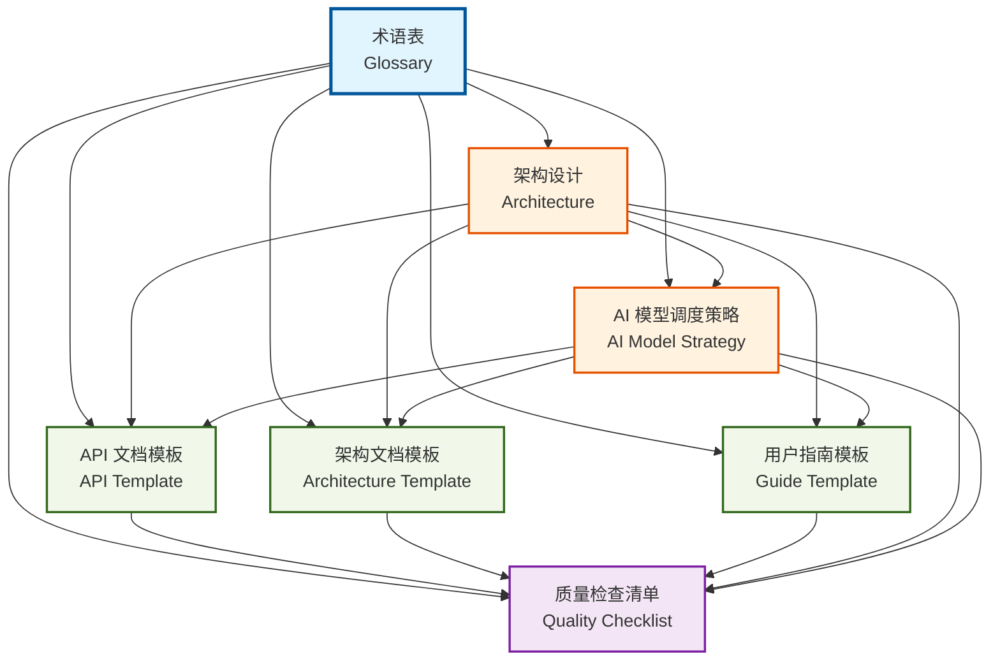

# 文档规范系统概览

欢迎来到 Dora Pocket 文档规范系统！本系统提供了一套完整的文档生成和质量保证解决方案，通过 **AI 模型自动化** 和 **分层规范体系**，确保项目文档的一致性、准确性和高质量。

## 核心哲学

高质量的文档是 `Dora Pocket` 项目的灵魂。清晰、准确、一致的文档能够极大地提升"道具"的可用性和开发者的使用体验。

- **用户中心**: 始终站在使用者的角度思考。文档是为了解决他们的问题，而不是展示我们的实现。
- **示例驱动**: 一个好的示例胜过千言万语。我们鼓励通过丰富的代码示例来阐述功能。
- **保持一致**: 遵循既定的模板和风格规范，能让整个文档网站看起来更专业、更可靠。

## 系统特性

- **AI 驱动的文档生成**: 利用 Codex、Gemini、Qwen 三种 AI 模型，自动生成高质量的技术文档
- **三层规范体系**: Layer 1 通用规范 → Layer 2 类型特定规范 → Layer 3 具体模板，分层继承设计
- **智能模型调度**: 根据文档类型和任务复杂度，自动选择最合适的 AI 模型
- **质量自动化验证**: 6 个通用质量维度 + 5 类文档特定检查清单，自动化评分和改进建议
- **端到端工作流程**: 从模板选择到质量验证的完整工作流程支持

## 核心文档

### 基础规范层

<div class="vp-raw">
  <div style="display: grid; grid-template-columns: repeat(auto-fit, minmax(300px, 1fr)); gap: 1rem; margin: 1.5rem 0;">
    <a href="./glossary" class="doc-card">
      <div class="doc-card-title">📖 术语表</div>
      <div class="doc-card-desc">核心术语、AI 模型名称和文档类型分类的权威定义</div>
      <div class="doc-card-tag">基础</div>
    </a>
    <a href="./architecture" class="doc-card">
      <div class="doc-card-title">🏗️ 架构设计</div>
      <div class="doc-card-desc">三层规范体系架构设计，定义通用规范、类型特定规范和具体模板的层次关系</div>
      <div class="doc-card-tag">核心</div>
    </a>
    <a href="./ai-model-strategy" class="doc-card">
      <div class="doc-card-title">🤖 AI 模型调度策略</div>
      <div class="doc-card-desc">AI 模型选择规则、能力矩阵、决策流程和 5 类文档类型的模型推荐方案</div>
      <div class="doc-card-tag">核心</div>
    </a>
  </div>
</div>

### 文档模板层

<div class="vp-raw">
  <div style="display: grid; grid-template-columns: repeat(auto-fit, minmax(300px, 1fr)); gap: 1rem; margin: 1.5rem 0;">
    <a href="./api-template" class="doc-card">
      <div class="doc-card-title">📘 API 文档模板</div>
      <div class="doc-card-desc">API 文档编写的增强版模板，包含类型定义、错误处理和性能考虑的详细规范</div>
      <div class="doc-card-tag">模板</div>
    </a>
    <a href="./architecture-template" class="doc-card">
      <div class="doc-card-title">🏛️ 架构文档模板</div>
      <div class="doc-card-desc">架构设计文档的标准模板，定义系统设计、技术选型和架构决策的规范结构</div>
      <div class="doc-card-tag">模板</div>
    </a>
    <a href="./guide-template" class="doc-card">
      <div class="doc-card-title">📗 用户指南模板</div>
      <div class="doc-card-desc">用户使用指南的标准模板，定义快速开始、核心概念、使用说明和常见问题的规范结构</div>
      <div class="doc-card-tag">模板</div>
    </a>
  </div>
</div>

### 质量保证层

<div class="vp-raw">
  <div style="display: grid; grid-template-columns: repeat(auto-fit, minmax(300px, 1fr)); gap: 1rem; margin: 1.5rem 0;">
    <a href="./quality-checklist" class="doc-card">
      <div class="doc-card-title">✅ 质量检查清单</div>
      <div class="doc-card-desc">文档质量的 6 个通用维度、5 类文档的特定检查项、3 级评分体系和自动化验证方法</div>
      <div class="doc-card-tag">质量</div>
    </a>
    <a href="./usage-guide" class="doc-card">
      <div class="doc-card-title">🚀 使用指南</div>
      <div class="doc-card-desc">端到端使用指南，提供 3 个完整的文档生成工作流程示例 (API 文档、架构文档、用户指南)</div>
      <div class="doc-card-tag">实战</div>
    </a>
  </div>
</div>

<style scoped>
.doc-card {
  display: block;
  padding: 1.5rem;
  border: 1px solid var(--vp-c-divider);
  border-radius: 8px;
  transition: all 0.2s;
  text-decoration: none;
  color: var(--vp-c-text-1);
  position: relative;
}

.doc-card:hover {
  border-color: var(--vp-c-brand);
  box-shadow: 0 2px 12px rgba(0, 0, 0, 0.1);
  transform: translateY(-2px);
}

.doc-card-title {
  font-size: 1.1rem;
  font-weight: 600;
  margin-bottom: 0.5rem;
  color: var(--vp-c-brand);
}

.doc-card-desc {
  font-size: 0.9rem;
  line-height: 1.5;
  color: var(--vp-c-text-2);
  margin-bottom: 1rem;
}

.doc-card-tag {
  display: inline-block;
  padding: 0.25rem 0.75rem;
  background: var(--vp-c-brand-soft);
  color: var(--vp-c-brand);
  border-radius: 12px;
  font-size: 0.8rem;
  font-weight: 500;
}
</style>

## 文档引用关系图

以下 Mermaid 图展示了 7 个规范文档之间的引用和依赖关系：



**图例说明**:

- **蓝色节点**: 基础规范 (术语表 - 被所有文档引用)
- **橙色节点**: 核心规范 (架构设计、AI 模型调度策略)
- **绿色节点**: 文档模板 (API、架构、用户指南)
- **紫色节点**: 质量保证 (质量检查清单 - 引用所有文档)

## 快速开始

### 1. 生成 API 文档

使用 Codex 生成 `@esdora/kit` 函数的 API 文档：

```bash
codex -C packages/kit --full-auto exec "
PURPOSE: 为 isCircular 函数生成 API 文档
TASK: 基于源码和测试生成完整的 Markdown 文档
MODE: auto
CONTEXT: @src/is/is-circular/**/* @tests/is/is-circular.test.ts
EXPECTED: 符合 api-template.md 规范的 API 文档
RULES: 遵循 L1+L2+L3 规范，使用 api-template.md 提示词
" --skip-git-repo-check -s danger-full-access
```

详见: [使用指南 → API 文档生成工作流程](./usage-guide#api-文档生成工作流程)

### 2. 生成架构文档

使用 Gemini 生成模块架构设计文档：

```bash
cd docs/contributing/documentation && gemini -p "
PURPOSE: 生成 [模块名称] 的架构设计文档
TASK: 分析模块的组件结构和依赖关系，绘制 Mermaid 架构图
MODE: write
CONTEXT: @../../../packages/[module-name]/src/**/*
EXPECTED: 完整的架构文档，包含 5 个章节、Mermaid 图表
RULES: 遵循 L1+L2 架构文档规范，使用 ADR 格式记录决策
" --approval-mode yolo
```

详见: [使用指南 → 架构文档生成工作流程](./usage-guide#架构文档生成工作流程)

### 3. 验证文档质量

使用自动化脚本检查文档质量：

```bash
# 检查单个文档
./scripts/check-doc-quality.sh docs/packages/kit/reference/is/is-circular.md

# 批量检查所有文档
./scripts/check-all-docs.sh
```

详见: [质量检查清单 → 自动化验证脚本](./quality-checklist#自动化验证脚本)

## 关键概念

### 三层规范体系

文档规范系统采用**分层继承设计**，确保一致性和可扩展性：

- **Layer 1 (L1) - 通用文档规范**: 所有文档共享的基础规范 (Frontmatter、标题结构、语言、链接格式、代码示例、注意事项)
- **Layer 2 (L2) - 文档类型特定规范**: 5 类文档类型各自的特定规范 (API 文档、架构文档、用户指南、最佳实践、贡献指南)
- **Layer 3 (L3) - 具体模板层**: 每类文档的可执行模板实现，包含完整的结构、示例和 AI 生成提示词

**继承关系**: `L3 继承 L2` → `L2 继承 L1` → **单向依赖，上层依赖下层，下层独立于上层**

详见: [架构设计 → 架构概述](./architecture#架构概述)

### AI 模型调度

根据**文档类型**和**任务复杂度**，自动选择最合适的 AI 模型：

| 文档类型     | 推荐模型 | 备选模型 | 选择理由                     |
| ------------ | -------- | -------- | ---------------------------- |
| **API 文档** | Codex    | Gemini   | 精确的类型签名和参数说明生成 |
| **架构文档** | Gemini   | Qwen     | 大上下文分析和架构理解能力   |
| **用户指南** | Gemini   | Codex    | 示例驱动和步骤化组织能力     |
| **最佳实践** | Gemini   | Qwen     | 模式识别和对比分析能力       |
| **贡献指南** | Codex    | Gemini   | 工作流程和脚本生成能力       |

详见: [AI 模型调度策略 → 文档类型模型推荐](./ai-model-strategy#文档类型模型推荐)

### 质量评分体系

文档质量通过 **6 个通用维度** 和 **类型特定检查项** 进行综合评分：

**评分公式**:

```
总分 = 通用维度得分 × 60% + 类型特定得分 × 40%
```

**通用维度** (各 10 分):

1. **准确性**: 类型签名、示例输出、参数说明与源码一致
2. **完整性**: 包含所有必需章节、字段和边界情况
3. **清晰度**: 表达简洁明了，术语准确，示例清晰
4. **一致性**: 遵循统一的格式、命名、结构和风格
5. **可用性**: 提供可运行示例、完整命令和有效链接
6. **中文规范**: 符合中文技术文档写作习惯

**质量等级**:

- **优秀** (90-100 分): 所有维度达标，具备创新性、深度和易用性
- **良好** (70-89 分): 核心维度达标，存在 2 个可改进项
- **需改进** (<70 分): 存在 1+ 个关键问题 (准确性、完整性、中文规范)

详见: [质量检查清单 → 质量评分体系](./quality-checklist#质量评分体系-3-级)

## 工作流程示例

### 完整的文档生成流程

1. **选择模板**: 根据文档类型选择对应的 Layer 3 模板
   - API 文档 → [API 文档模板](./api-template)
   - 架构文档 → [架构文档模板](./architecture-template)
   - 用户指南 → [用户指南模板](./guide-template)

2. **准备输入**: 收集源码、测试用例、设计文档等输入材料

3. **选择 AI 模型**: 根据 [AI 模型调度策略](./ai-model-strategy) 选择推荐模型
   - API 文档 → 优先 Codex
   - 架构文档 → 优先 Gemini
   - 用户指南 → 优先 Gemini

4. **生成文档**: 使用 AI 模型和模板提示词生成文档
   - Codex: 使用 `codex --full-auto exec` 命令
   - Gemini: 使用 `gemini -p` 命令，MODE=write

5. **质量验证**: 运行自动化验证脚本，检查质量分数
   - 单文档: `./scripts/check-doc-quality.sh <file>`
   - 批量: `./scripts/check-all-docs.sh`

6. **迭代优化**: 根据验证结果和改进建议，优化文档质量
   - 分数 < 70 → 修复关键问题 (准确性、完整性)
   - 分数 70-89 → 补充边界情况、增加示例
   - 分数 >= 90 → 文档达标，可发布

详见: [使用指南 → 端到端工作流程](./usage-guide)

## 常见问题

### 如何为新的包 (如 @esdora/biz) 生成文档?

1. 使用 API 文档模板生成函数文档:

   ```bash
   codex -C packages/biz --full-auto exec "为 [function-name] 生成 API 文档" \
     --skip-git-repo-check -s danger-full-access
   ```

2. 使用架构文档模板生成模块架构说明:

   ```bash
   cd docs && gemini -p "生成 @esdora/biz 的架构设计文档" --approval-mode yolo
   ```

3. 运行质量检查确保文档符合标准:
   ```bash
   ./scripts/check-doc-quality.sh docs/packages/biz/**/*.md
   ```

### 如何自定义文档模板?

1. **基于现有模板扩展**: 在 Layer 3 模板基础上添加项目特定规范
2. **遵循继承原则**: 保持 L1 通用规范 + L2 类型规范 + L3 模板的继承关系
3. **更新 AI 提示词**: 在模板中添加或修改 AI 生成提示词的"核心指令与规范"部分
4. **验证质量标准**: 确保自定义模板生成的文档能通过质量检查清单验证

详见: [架构设计 → Layer 3 具体模板层](./architecture#layer-3-具体模板层)

### 文档生成失败或质量低怎么办?

1. **检查输入材料**: 确保源码、测试用例、JSDoc 注释完整准确
2. **调整 AI 模型**: 尝试使用备选模型 (Gemini ↔ Qwen, Codex ↔ Gemini)
3. **优化提示词**: 在模板提示词基础上添加具体的上下文和约束
4. **手动审查修正**: 对 AI 生成的内容进行人工审查和优化
5. **迭代生成**: 使用 Codex 会话恢复功能 (`resume --last`) 进行迭代优化

详见: [使用指南 → 故障排查](./usage-guide#故障排查)

## 下一步

- **深入学习**: 阅读 [架构设计](./architecture) 了解三层规范体系的设计原理
- **实战演练**: 跟随 [使用指南](./usage-guide) 完成 3 个端到端工作流程示例
- **质量提升**: 参考 [质量检查清单](./quality-checklist) 理解文档质量标准和评分体系
- **模型优化**: 研究 [AI 模型调度策略](./ai-model-strategy) 掌握模型选择和使用技巧
