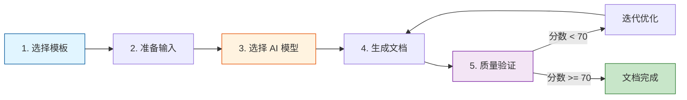

# 文档规范系统使用指南

本指南提供**端到端的文档生成工作流程**，通过 3 个完整示例（API 文档、架构文档、用户指南）展示如何使用文档规范系统生成高质量文档。

## 概述

### 工作流程总览

文档生成的完整流程分为 5 个步骤：



### 核心原则

1. **模板优先**: 始终基于 Layer 3 模板生成文档，确保结构一致性
2. **输入完整**: 提供完整的源码、测试用例和上下文，避免 AI 臆造内容
3. **模型匹配**: 根据文档类型选择最合适的 AI 模型（参见 [AI 模型调度策略](./ai-model-strategy)）
4. **质量验证**: 使用自动化脚本验证文档质量，确保符合标准
5. **迭代优化**: 根据验证结果持续改进，直至达到优秀等级（>= 90 分）

## 工作流程示例 1: API 文档生成

### 适用场景

为 `@esdora/kit` 或 `@esdora/color` 等包的**函数、类、接口**生成 API 参考文档。

### 完整流程 (5 步骤)

#### 步骤 1: 选择模板

使用 [API 文档模板](./api-template)，该模板：
- 继承 L1 通用规范 + L2 API 文档规范 + L3 增强规范
- 包含类型定义、错误处理、性能考虑的详细规范
- 提供完整的 AI 生成提示词和 4 个质量检查点

#### 步骤 2: 准备输入材料

**必需材料**:
- **函数源码文件**: `packages/kit/src/is/is-circular/index.ts`
- **单元测试文件**: `packages/kit/tests/is/is-circular.test.ts`

**可选材料**:
- **JSDoc 注释**: 源码中的参数和返回值说明
- **相关模块**: 函数依赖的其他模块（如工具函数、类型定义）

**验证清单**:
- [ ] 源码文件存在且包含完整的类型签名
- [ ] 测试文件存在且覆盖主要使用场景和边界情况
- [ ] JSDoc 注释完整（如果有）

#### 步骤 3: 选择 AI 模型

根据 [AI 模型调度策略](./ai-model-strategy#1-api-文档)：

- **推荐模型**: **Codex** (`gpt-5.1-codex`)
  - 优势: 精确的类型签名生成、参数表格自动化、测试用例理解深入
  - 适用: 单函数 API 文档、类型复杂度高的函数

- **备选模型**: **Gemini** (`gemini-2.5-pro`)
  - 适用: 涉及复杂跨模块依赖、需要深度架构理解的 API

#### 步骤 4: 生成文档

**使用 Codex 生成**（推荐）:

```bash
# 第一个函数文档 - 建立完整上下文
codex -C packages/kit --full-auto exec "
PURPOSE: 为 isCircular 函数生成增强版 API 文档
TASK:
• 读取源码和测试文件
• 提取类型签名、参数说明、返回值、泛型约束
• 生成示例代码（基本用法 + 高级场景）
• 添加错误处理说明和性能考虑
• 执行 4 个质量检查点验证
MODE: auto
CONTEXT: @src/is/is-circular/**/* @tests/is/is-circular.test.ts @../../docs/contributing/documentation/api-template.md
EXPECTED: 完整的 API 文档，符合 api-template.md 规范，包含类型定义、错误处理、性能说明，通过 4 个质量检查点
RULES: \$(cat ~/.claude/workflows/cli-templates/prompts/development/02-implement-feature.txt) | 遵循 L1+L2+L3 规范，使用 api-template.md 提示词 | auto=FULL operations
" --skip-git-repo-check -s danger-full-access

# 后续函数文档 - 使用会话恢复
codex --full-auto exec "为 is-empty 函数生成类似的增强版 API 文档" resume --last --skip-git-repo-check -s danger-full-access
```

**使用 Gemini 生成**（备选，复杂依赖场景）:

```bash
cd packages/kit && gemini -p "
PURPOSE: 为涉及复杂跨模块依赖的 API 生成增强版文档
TASK:
• 分析函数的跨模块依赖关系
• 提取类型签名和泛型约束
• 生成完整的示例代码和边界情况说明
• 添加性能考虑和优化建议
MODE: write
CONTEXT: @src/**/* @tests/**/* @../../docs/contributing/documentation/api-template.md | Memory: 遵循 api-template.md 增强规范，包含类型定义、错误处理、性能说明
EXPECTED: 符合 api-template.md 规范的 API 文档，通过 4 个质量检查点
RULES: \$(cat ~/.claude/workflows/cli-templates/prompts/development/02-implement-feature.txt) | 遵循 L1+L2+L3 规范 | write=CREATE/MODIFY/DELETE
" --approval-mode yolo
```

**生成输出**:
- 文档路径: `docs/packages/kit/reference/is/is-circular.md`
- 包含章节: 示例、签名与说明、注意事项与边界情况、相关链接

#### 步骤 5: 质量验证

**自动化验证**:

```bash
# 检查单个文档
./scripts/check-doc-quality.sh docs/packages/kit/reference/is/is-circular.md

# 示例输出:
# ======================================
# 文档质量检查: docs/packages/kit/reference/is/is-circular.md
# ======================================
#
# ## 通用质量检查 (60%)
#   准确性得分: 10 / 10
#   完整性得分: 10 / 10
#   清晰度得分: 10 / 10
#   一致性得分: 10 / 10
#   可用性得分: 10 / 10
#   中文规范得分: 10 / 10
#
# ## 类型特定检查 (40%)
# 检测到文档类型: api
#   ✅ [+10] 包含类型签名
#   ✅ [+10] 包含边界情况说明
#   ✅ [+5] 包含基本用法
#   ✅ [+5] 包含高级场景示例
#   ✅ [+10] 包含性能说明
#   类型特定得分: 40 / 40
#
# ## 质量评分结果
# 总分: 100 / 100
# 质量等级: ✅ 优秀 (90-100 分)
```

**手动检查点**（参见 [API 文档检查清单](./quality-checklist#1-api-文档检查清单-4-项)）:

- [ ] **类型准确性**: 函数签名、参数类型、返回值类型与源码完全一致
- [ ] **边界情况覆盖**: 所有测试用例中的边界情况都在文档中说明
- [ ] **示例完整性**: 包含基本用法和 2-3 个高级场景示例
- [ ] **性能说明**: 标注时间复杂度和空间复杂度（如适用）

**迭代优化** (分数 < 90):

```bash
# 分数 70-89: 补充边界情况和性能说明
# 在文档中添加:
## 性能考虑

### 时间复杂度
- **复杂度**: O(n) - 其中 n 为对象属性数量
- **说明**: 使用 WeakSet 追踪访问过的对象，每个对象仅访问一次

### 空间复杂度
- **复杂度**: O(n) - WeakSet 存储访问过的对象引用
- **优化**: WeakSet 允许垃圾回收，不影响内存管理

# 重新运行验证
./scripts/check-doc-quality.sh docs/packages/kit/reference/is/is-circular.md
```

### 成功标准

- ✅ 质量得分 >= 90 分
- ✅ 所有必需章节完整（示例、签名与说明、注意事项、相关链接）
- ✅ 类型签名与源码一致
- ✅ 示例代码可直接运行
- ✅ 边界情况覆盖全面

## 工作流程示例 2: 架构文档生成

### 适用场景

为**模块、系统、技术选型**生成架构设计文档，说明设计原则、组件关系和技术决策。

### 完整流程 (5 步骤)

#### 步骤 1: 选择模板

使用 [架构文档模板](./architecture-template)，该模板：
- 继承 L1 通用规范 + L2 架构文档规范
- 包含 5 个必需章节（概述、设计决策、系统结构、技术栈、权衡分析）
- 强制要求 Mermaid 架构图和 ADR 格式决策记录

#### 步骤 2: 准备输入材料

**必需材料**:
- **模块源码**: `packages/[module-name]/src/**/*`
- **依赖配置**: `packages/[module-name]/package.json`、`tsconfig.json`
- **设计文档**: 如有已存在的设计说明或技术需求文档

**可选材料**:
- **README.md**: 模块的功能说明和使用指南
- **测试文件**: 理解模块的功能边界

**验证清单**:
- [ ] 模块源码结构清晰，可识别主要组件
- [ ] package.json 包含完整的依赖列表
- [ ] 设计文档或 README 说明模块的核心功能

#### 步骤 3: 选择 AI 模型

根据 [AI 模型调度策略](./ai-model-strategy#2-架构文档)：

- **推荐模型**: **Gemini** (`gemini-2.5-pro`)
  - 优势: 大上下文分析能力强，擅长架构审查和模式识别
  - 适用: 跨模块的组件关系、数据流和技术选型分析

- **备选模型**: **Qwen** (`qwen-coder`)
  - 适用: Gemini 不可用时，或小型模块的架构文档

#### 步骤 4: 生成文档

**使用 Gemini 生成**（推荐）:

```bash
cd docs/contributing/documentation && gemini -p "
PURPOSE: 生成文档规范体系的架构设计文档
TASK:
• 分析 3 层规范体系的设计原则
• 绘制架构可视化图表 (Mermaid)
• 说明组件关系和继承规则
• 记录关键设计决策 (ADR 格式)
• 分析优势、限制和未来改进方向
MODE: write
CONTEXT: @**/* @../../../packages/*/src/**/* | Memory: 基于已有 glossary.md 定义的 5 类文档类型，遵循分层继承原则
EXPECTED: 完整的架构文档，包含 5 个章节（概述、设计决策、系统结构、技术栈、权衡分析）、Mermaid 图、ADR 记录
RULES: \$(cat ~/.claude/workflows/cli-templates/prompts/analysis/02-review-architecture.txt) | 遵循 L1+L2 架构文档规范 | write=CREATE/MODIFY/DELETE
" --approval-mode yolo
```

**生成输出**:
- 文档路径: `docs/contributing/documentation/architecture.md`
- 包含章节: 概述、设计决策、系统结构、技术栈、权衡分析

#### 步骤 5: 质量验证

**自动化验证**:

```bash
./scripts/check-doc-quality.sh docs/contributing/documentation/architecture.md

# 检查要点:
# ✅ 包含 Mermaid 图表
# ✅ 包含 ADR 格式决策记录
# ✅ 包含技术选型论证
# ✅ 包含权衡分析（优势、限制、风险）
```

**手动检查点**（参见 [架构文档检查清单](./quality-checklist#2-架构文档检查清单-4-项)）:

- [ ] **设计决策完整性**: 使用 ADR 格式记录至少 2-3 个关键决策
- [ ] **图表清晰度**: Mermaid 图表准确反映系统结构，节点和边的标签清晰
- [ ] **技术选型论证**: 所有技术选择都有明确的理由和权衡说明
- [ ] **权衡分析深度**: 诚实说明优势、限制和风险，提供缓解措施

**迭代优化** (分数 < 90):

```bash
# 分数 70-89: 补充 ADR 决策记录和 Mermaid 图表

# 添加 ADR 格式决策记录:
## 设计决策

### 采用三层规范体系

**背景**: 需要统一文档规范，同时保持灵活性和可扩展性

**考虑的方案**:
1. **单层扁平规范** - 优点: 简单直接 / 缺点: 难以扩展，类型间规范冲突
2. **三层分层规范** - 优点: 清晰继承，易扩展 / 缺点: 学习曲线稍高

**最终决策**: 选择方案 2（三层分层规范）

**理由**: 分层继承设计确保一致性（L1 通用规范）和灵活性（L2+L3 特定规范），支持未来新增文档类型

**影响**: 所有文档必须遵循 L1+L2+L3 的继承关系

# 重新验证
./scripts/check-doc-quality.sh docs/contributing/documentation/architecture.md
```

### 成功标准

- ✅ 质量得分 >= 90 分
- ✅ 包含 Mermaid 架构图且清晰易懂
- ✅ 使用 ADR 格式记录至少 2-3 个关键决策
- ✅ 技术选型有明确理由和版本要求
- ✅ 权衡分析诚实说明优势和限制

## 工作流程示例 3: 用户指南生成

### 适用场景

为**功能、模块、工具**生成用户使用指南，提供快速上手、核心概念、使用说明和常见问题。

### 完整流程 (5 步骤)

#### 步骤 1: 选择模板

使用 [用户指南模板](./guide-template)，该模板：
- 继承 L1 通用规范 + L2 用户指南规范
- 包含 4 个必需章节（快速开始、核心概念、使用说明、常见问题）
- 强调步骤化组织、问题导向结构和实用示例

#### 步骤 2: 准备输入材料

**必需材料**:
- **功能说明**: 模块或功能的核心特性和目标
- **API 文档**: 如有现成的 API 参考文档或源码注释
- **使用场景**: 典型的使用场景和用户需求

**可选材料**:
- **测试用例**: 理解功能的边界和使用方式
- **README.md**: 现有的快速上手指南

**验证清单**:
- [ ] 功能说明清晰，包含核心特性和适用场景
- [ ] API 文档或源码注释完整
- [ ] 识别了 3-5 个典型使用场景

#### 步骤 3: 选择 AI 模型

根据 [AI 模型调度策略](./ai-model-strategy#3-用户指南)：

- **推荐模型**: **Gemini** (`gemini-2.5-pro`)
  - 优势: 示例生成能力强，擅长内容组织和用户视角思考
  - 适用: 示例驱动和步骤化组织，多模块使用场景

- **备选模型**: **Codex** (`gpt-5.1-codex`)
  - 适用: 侧重代码示例和脚本生成时使用

#### 步骤 4: 生成文档

**使用 Gemini 生成**（推荐）:

```bash
cd docs && gemini -p "
PURPOSE: 为 @esdora/kit 创建快速上手指南
TASK:
• 设计 3-5 个常用场景的使用示例
• 组织步骤化的安装和配置流程
• 定义核心术语和工作原理说明
• 提供常见问题的解决方案（至少 5 个）
MODE: write
CONTEXT: @packages/kit/**/* @README.md | Memory: 用户中心原则，示例驱动的文档哲学，遵循 Dora Pocket 文档风格
EXPECTED: 完整的用户指南，包含 4 个章节（快速开始、核心概念、使用说明、常见问题）、可运行示例和预期结果验证
RULES: \$(cat ~/.claude/workflows/cli-templates/prompts/development/02-implement-component-ui.txt) | 遵循 L1+L2 用户指南规范，所有示例包含完整上下文 | write=CREATE/MODIFY/DELETE
" --approval-mode yolo
```

**生成输出**:
- 文档路径: `docs/guide/getting-started.md`
- 包含章节: 快速开始、核心概念、使用说明、常见问题

#### 步骤 5: 质量验证

**自动化验证**:

```bash
./scripts/check-doc-quality.sh docs/guide/getting-started.md

# 检查要点:
# ✅ 包含快速开始章节（安装 + 基础示例）
# ✅ 包含核心概念章节（术语表 + 工作原理）
# ✅ 包含使用说明章节（多场景示例）
# ✅ 包含常见问题章节（至少 5 个问题）
```

**手动检查点**（参见 [用户指南检查清单](./quality-checklist#3-用户指南检查清单-3-项)）:

- [ ] **示例可运行性**: 所有代码示例包含必要的 import 语句，可以直接复制运行
- [ ] **概念解释清晰度**: 术语定义简明易懂，工作原理说明避免过度技术化
- [ ] **问题覆盖全面性**: 常见问题章节覆盖至少 5 个典型用户疑问

**迭代优化** (分数 < 90):

```bash
# 分数 70-89: 补充常见问题和优化示例可运行性

# 添加常见问题:
## 常见问题

### 如何在 TypeScript 项目中使用?

**安装**:
```bash
pnpm add @esdora/kit
```

**配置 tsconfig.json**:
```json
{
  "compilerOptions": {
    "moduleResolution": "bundler",
    "types": ["@esdora/kit"]
  }
}
```

**使用示例**:
```typescript
import { isCircular } from '@esdora/kit'

const obj = { a: 1 }
obj.self = obj

isCircular(obj) // => true
```

### 遇到 "Module not found" 错误怎么办?

**原因**: 包未正确安装或路径配置错误

**解决步骤**:
1. 检查 package.json 中是否有 `@esdora/kit` 依赖
2. 运行 `pnpm install` 重新安装
3. 检查 import 路径是否正确

# 重新验证
./scripts/check-doc-quality.sh docs/guide/getting-started.md
```

### 成功标准

- ✅ 质量得分 >= 90 分
- ✅ 快速开始章节包含完整的安装步骤和可运行示例
- ✅ 核心概念章节定义关键术语且易懂
- ✅ 使用说明章节提供 3-5 个场景示例
- ✅ 常见问题章节覆盖至少 5 个典型疑问

## 最佳实践

### 1. 输入材料准备

- **源码优先**: 确保源码包含完整的类型签名和 JSDoc 注释
- **测试驱动**: 从测试用例中提取边界情况和使用场景
- **上下文丰富**: 提供完整的上下文（依赖模块、配置文件、README）

### 2. AI 模型使用

- **遵循推荐**: 优先使用文档类型的推荐模型（API → Codex, 架构 → Gemini）
- **会话复用**: 使用 Codex 会话恢复功能 (`resume --last`) 批量生成文档
- **备选切换**: 推荐模型失败时，及时切换到备选模型

### 3. 质量验证

- **自动化优先**: 使用脚本批量检查，快速识别问题
- **手动审查**: 自动化脚本无法完全替代人工审查，关注内容准确性
- **迭代优化**: 根据验证结果持续改进，直至达到优秀等级

### 4. 文档维护

- **版本更新**: 代码变更后及时更新文档（类型签名、参数说明、边界情况）
- **链接检查**: 定期运行链接验证，确保内部链接和外部链接有效
- **术语一致**: 参考 [术语表](./glossary) 使用统一的术语和命名

### 5. 团队协作

- **模板共享**: 团队成员使用相同的 Layer 3 模板，确保文档一致性
- **Code Review**: 文档变更纳入 Code Review 流程，确保质量
- **CI/CD 集成**: 在 PR 中自动运行质量检查脚本，拒绝低质量文档合并

## 故障排查

### 问题 1: AI 生成的文档类型签名不准确

**症状**:
- 函数签名与源码不一致
- 缺少泛型约束或联合类型
- 参数类型简化或错误

**原因**:
- AI 模型未能正确解析 TypeScript 类型
- 源码中的类型定义过于复杂
- 提示词中未明确要求"完整的类型签名"

**解决方案**:

1. **检查源码**: 确保源码包含完整的类型定义
   ```bash
   cat packages/kit/src/is/is-circular/index.ts
   # 确认类型签名完整且准确
   ```

2. **优化提示词**: 在 EXPECTED 字段中明确要求
   ```
   EXPECTED: 完整的 API 文档，类型签名与源码完全一致（包括泛型、约束、联合类型）
   ```

3. **手动修正**: 对比源码和文档，手动修正类型签名
   ```markdown
   ### 类型签名

   ```typescript
   function isCircular<T extends object>(obj: T): boolean
   ```

4. **重新验证**: 运行质量检查确保准确性得分 >= 10
   ```bash
   ./scripts/check-doc-quality.sh docs/packages/kit/reference/is/is-circular.md
   ```

### 问题 2: 边界情况覆盖不全

**症状**:
- 文档缺少"注意事项与边界情况"章节
- 测试用例中的边界情况未在文档中说明
- 错误处理部分缺失

**原因**:
- AI 模型未能从测试用例中提取边界情况
- 提示词中未明确要求"从测试用例提取边界情况"
- 测试用例覆盖不全

**解决方案**:

1. **检查测试用例**: 确认测试文件包含边界情况测试
   ```bash
   rg "expect.*null|undefined|empty|边界" packages/kit/tests/is/is-circular.test.ts -A 1
   ```

2. **优化提示词**: 在 TASK 字段中明确要求
   ```
   TASK:
   • 从测试用例中提取所有边界情况（null、undefined、空值、负数等）
   • 说明特殊输入的处理方式和预期输出
   ```

3. **手动补充**: 参考测试用例手动添加边界情况
   ```markdown
   ## 注意事项与边界情况

   ### 输入边界

   - **null 或 undefined**: 返回 `false`（非对象类型无法循环引用）
   - **空对象 `{}`**: 返回 `false`（无属性，无循环引用）
   - **已访问对象**: 使用 WeakSet 追踪，避免无限递归
   ```

4. **重新验证**: 确保完整性得分 >= 10
   ```bash
   ./scripts/check-doc-quality.sh docs/packages/kit/reference/is/is-circular.md
   ```

### 问题 3: 示例代码无法运行

**症状**:
- 示例代码缺少 import 语句
- 示例使用了未定义的变量或函数
- 输出注释 `// =>` 与实际运行结果不一致

**原因**:
- AI 模型生成的示例缺少完整上下文
- 提示词中未强调"所有示例包含 import 语句"
- 示例代码未实际运行验证

**解决方案**:

1. **优化提示词**: 在 RULES 字段中明确要求
   ```
   RULES: 所有示例代码必须包含 import 语句，可独立运行，输出注释 // => 准确
   ```

2. **手动验证**: 复制示例代码到临时文件，运行确认
   ```bash
   # 创建临时测试文件
   cat > /tmp/test.ts << 'EOF'
   import { isCircular } from '@esdora/kit'

   const obj = { a: 1 }
   obj.self = obj

   console.log(isCircular(obj)) // => true
   EOF

   # 运行测试
   ts-node /tmp/test.ts
   # 输出: true
   ```

3. **修正示例**: 确保所有示例包含完整上下文
   ```markdown
   ### 基本用法

   ```typescript
   import { isCircular } from '@esdora/kit'

   const obj = { a: 1 }
   obj.self = obj

   isCircular(obj) // => true
   ```

4. **重新验证**: 确保可用性得分 >= 10
   ```bash
   ./scripts/check-doc-quality.sh docs/packages/kit/reference/is/is-circular.md
   ```

### 问题 4: Mermaid 图表无法渲染

**症状**:
- Mermaid 图表在 VitePress 中显示空白
- 图表语法错误导致渲染失败
- 图表节点或边的标签缺失

**原因**:
- Mermaid 语法错误（如节点 ID 包含特殊字符）
- VitePress Mermaid 插件配置问题
- 图表过于复杂导致渲染超时

**解决方案**:

1. **验证语法**: 在 Mermaid Live Editor 中测试图表
   ```
   访问: https://mermaid.live/
   粘贴图表代码，确认能正确渲染
   ```

2. **简化图表**: 减少节点数量，使用简洁的标签
   ```mermaid
   graph TD
       A[术语表] --> B[架构设计]
       A --> C[AI 模型调度]
       B --> D[API 模板]
       C --> D
   ```

3. **检查配置**: 确认 VitePress 启用了 Mermaid 支持
   ```typescript
   // docs/.vitepress/config.ts
   import { defineConfig } from 'vitepress'

   export default defineConfig({
     markdown: {
       config: (md) => {
         // Mermaid 插件应已配置
       }
     }
   })
   ```

4. **重新验证**: 运行 VitePress 开发服务器确认渲染
   ```bash
   npm run docs:dev
   # 访问 http://localhost:5173/contributing/documentation/architecture
   # 确认 Mermaid 图表正确显示
   ```

### 问题 5: 质量得分低于 70 分

**症状**:
- 自动化脚本报告得分 < 70 分
- 缺少多个必需章节
- 准确性、完整性、中文规范得分低

**原因**:
- 文档未遵循 Layer 3 模板结构
- AI 生成内容质量不足
- 缺少关键信息（类型签名、边界情况、示例）

**解决方案**:

1. **识别关键问题**: 查看脚本输出的失败项
   ```bash
   ./scripts/check-doc-quality.sh docs/packages/kit/reference/is/is-circular.md
   # 输出:
   #   ❌ [+0] 缺少"注意事项与边界情况"章节
   #   ❌ [+0] 示例未包含 import 语句
   #   ⚠️  [+2] 可能存在中英文标点混用
   ```

2. **优先修复准确性问题**: 对比源码纠正类型签名和参数说明
   ```markdown
   ### 类型签名

   ```typescript
   function isCircular<T extends object>(obj: T): boolean
   ```

   ### 参数说明

   | 参数 | 类型 | 描述 | 必需 |
   |------|------|------|------|
   | obj  | T extends object | 待检测的对象 | 是 |
   ```

3. **补充缺失章节**: 根据模板添加必需章节
   ```markdown
   ## 注意事项与边界情况

   ### 输入边界
   - null 或 undefined: 返回 `false`
   - 空对象: 返回 `false`

   ### 错误处理
   - **异常类型**: 无异常（纯函数，无副作用）
   - **处理建议**: 无需 try-catch 包裹
   ```

4. **规范中文表达**: 避免生硬翻译，使用主动语态
   ```markdown
   # 原: "可以被用来检测对象是否包含循环引用"
   # 改: "用于检测对象是否包含循环引用"
   ```

5. **重新验证**: 确保得分 >= 70 分
   ```bash
   ./scripts/check-doc-quality.sh docs/packages/kit/reference/is/is-circular.md
   # 总分: 85 / 100
   # 质量等级: ⚠️  良好 (70-89 分)
   ```

6. **持续优化**: 根据改进建议提升至优秀等级
   ```bash
   # 补充性能说明和高级示例后:
   # 总分: 92 / 100
   # 质量等级: ✅ 优秀 (90-100 分)
   ```

## 相关资源

- [术语表](./glossary) - 核心术语和命名规范
- [架构设计](./architecture) - 三层规范体系设计
- [AI 模型调度策略](./ai-model-strategy) - 模型选择和使用规范
- [API 文档模板](./api-template) - API 文档的增强规范
- [架构文档模板](./architecture-template) - 架构文档的规范
- [用户指南模板](./guide-template) - 用户指南的规范
- [质量检查清单](./quality-checklist) - 文档质量验证标准
