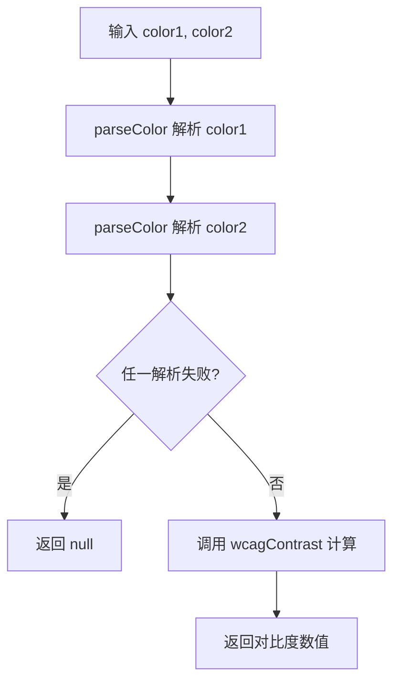

# getContrast

计算两种颜色之间的对比度，返回符合 WCAG（Web Content Accessibility Guidelines）标准的对比度数值。

## 示例

### 基本用法

```typescript
import { getContrast } from '@esdora/color'

getContrast('#FFFFFF', '#000000') // => 21
getContrast('#808080', '#FFFFFF') // => 3.949
```

### 不同颜色格式

```typescript
import { getContrast } from '@esdora/color'

// RGB 字符串
getContrast('rgb(255, 255, 255)', 'rgb(0, 0, 0)') // => 21

// 颜色对象
getContrast(
  { r: 255, g: 255, b: 255, mode: 'rgb' },
  { r: 0, g: 0, b: 0, mode: 'rgb' },
) // => 21
```

### 无效颜色

```typescript
import { getContrast } from '@esdora/color'

getContrast('invalid-color', '#000000') // => null
getContrast('#ffffff', 'invalid-color') // => null
getContrast('invalid-color1', 'invalid-color2') // => null
```

## 签名

```typescript
function getContrast(
  color1: string | EsdoraColor,
  color2: string | EsdoraColor,
): number | null
```

## 参数

| 参数   | 类型                    | 描述                                  | 必需 |
| ------ | ----------------------- | ------------------------------------- | ---- |
| color1 | `string \| EsdoraColor` | 第一个颜色，支持 CSS 字符串或颜色对象 | 是   |
| color2 | `string \| EsdoraColor` | 第二个颜色，支持 CSS 字符串或颜色对象 | 是   |

## 返回值

- **类型**: `number \| null`
- **说明**: 两种颜色之间的 WCAG 对比度数值，范围从 1（完全相同）到 21（黑白极端）。
- **特殊情况**: 当任一颜色无法解析时，返回 `null`。

## 运行逻辑



函数首先分别解析两个输入颜色，如果任一解析失败则直接返回 `null`；解析成功后调用 culori 的 `wcagContrast` 计算并返回对比度比值。

## 注意事项

### 输入边界

- 支持 CSS 颜色字符串（如 `#FFFFFF`、`rgb(255, 255, 255)`）和 Esdora 颜色对象（如 `{ r, g, b, mode: 'rgb' }`）。
- 传入 `null` 或其他无法解析的值时，函数返回 `null`，不会抛出异常。

### 错误处理

- 函数**不抛出异常**，所有错误情况通过返回 `null` 表达。
- 即使两个颜色都无效，也返回 `null`。

### 性能考虑

- **时间复杂度**: O(1) — 仅涉及两次颜色解析和一次对比度计算，无遍历操作。
- **空间复杂度**: O(1) — 不依赖额外数据结构。

### 兼容性

- **环境要求**: 依赖 culori 的 `wcagContrast` 函数，适用于所有支持 ESM 的现代 JavaScript 运行时。

## 相关链接

- [源码](https://github.com/kkfive/esdora/tree/main/packages/color/src/analysis/get-contrast/index.ts)
- [单元测试](https://github.com/kkfive/esdora/tree/main/packages/color/src/analysis/get-contrast/index.test.ts)
