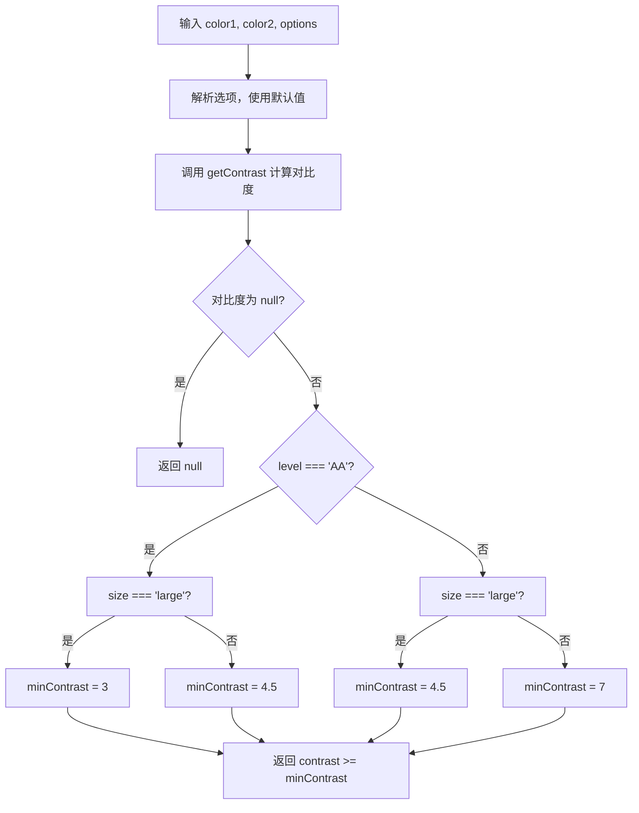

# isAccessible

检查两种颜色之间的对比度是否符合 WCAG 可访问性标准。

## 示例

### 基本用法

```typescript
import { isAccessible } from '@esdora/color'

// 默认 AA 级别，普通文本
isAccessible('#000000', '#FFFFFF') // => true
isAccessible('#999999', '#FFFFFF') // => false
```

### 不同 WCAG 级别

```typescript
import { isAccessible } from '@esdora/color'

// AAA 级别要求更高
isAccessible('#000000', '#FFFFFF', { level: 'AAA' }) // => true
isAccessible('#767676', '#FFFFFF', { level: 'AAA' }) // => false
```

### 大文本场景

```typescript
import { isAccessible } from '@esdora/color'

// 大文本在 AA 级别下对比度要求更低（3:1）
isAccessible('#949494', '#FFFFFF', { level: 'AA', size: 'large' }) // => true

// 大文本在 AAA 级别下要求 4.5:1
isAccessible('#767676', '#FFFFFF', { level: 'AAA', size: 'large' }) // => true
isAccessible('#999999', '#FFFFFF', { level: 'AAA', size: 'large' }) // => false
```

### 多种颜色格式

```typescript
import { isAccessible } from '@esdora/color'

// RGB 字符串
isAccessible('rgb(0, 0, 0)', 'rgb(255, 255, 255)') // => true

// HSL 字符串
isAccessible('hsl(0, 0%, 0%)', 'hsl(0, 0%, 100%)') // => true

// 颜色对象
isAccessible(
  { r: 0, g: 0, b: 0, mode: 'rgb' },
  { r: 255, g: 255, b: 255, mode: 'rgb' },
) // => true
```

### 无效输入

```typescript
import { isAccessible } from '@esdora/color'

// 无效颜色返回 null
isAccessible('invalid-color', '#FFFFFF') // => null
isAccessible('#000000', 'invalid-color') // => null
```

## 签名

```typescript
export interface AccessibilityOptions {
  level?: 'AA' | 'AAA'
  size?: 'normal' | 'large'
}

export function isAccessible(
  color1: string | EsdoraColor,
  color2: string | EsdoraColor,
  options?: AccessibilityOptions,
): boolean | null
```

## 参数

| 参数    | 类型                    | 描述                         | 必需 |
| ------- | ----------------------- | ---------------------------- | ---- |
| color1  | `string \| EsdoraColor` | 第一个颜色（通常是文本颜色） | 是   |
| color2  | `string \| EsdoraColor` | 第二个颜色（通常是背景颜色） | 是   |
| options | `AccessibilityOptions`  | 可访问性选项                 | 否   |

### AccessibilityOptions

| 字段  | 类型                  | 描述              | 默认值     |
| ----- | --------------------- | ----------------- | ---------- |
| level | `'AA' \| 'AAA'`       | WCAG 可访问性级别 | `'AA'`     |
| size  | `'normal' \| 'large'` | 文本大小          | `'normal'` |

## 返回值

- **类型**: `boolean | null`
- **说明**: 如果两种颜色的对比度符合指定的 WCAG 标准则返回 `true`，不符合则返回 `false`。
- **特殊情况**: 当任一颜色输入无效时，返回 `null`。

## 运行逻辑



函数首先通过 `getContrast` 计算两种颜色的 WCAG 对比度。如果输入颜色无效，直接返回 `null`。然后根据 `level` 和 `size` 的组合确定最小对比度阈值，最后将实际对比度与阈值比较并返回布尔结果。

## 注意事项

### 输入边界

- 支持的颜色格式包括 HEX 字符串（如 `#000000`）、RGB 字符串（如 `rgb(0, 0, 0)`）、HSL 字符串（如 `hsl(0, 0%, 0%)`）以及 `EsdoraColor` 对象。
- 当不传入 `options` 时，默认使用 `AA` 级别和 `normal` 文本大小。
- 可以只传入 `level` 或 `size` 中的某一个，另一个会使用默认值。

### 错误处理

- 当任一颜色输入无效（如非法字符串、`null`、`undefined`）时，函数返回 `null`，不会抛出异常。
- 返回值类型为 `boolean | null`，调用方应处理 `null` 的情况。

## 相关链接

- [源码](/packages/color/src/analysis/is-accessible/index.ts)
- [单元测试](/packages/color/src/analysis/is-accessible/index.test.ts)
