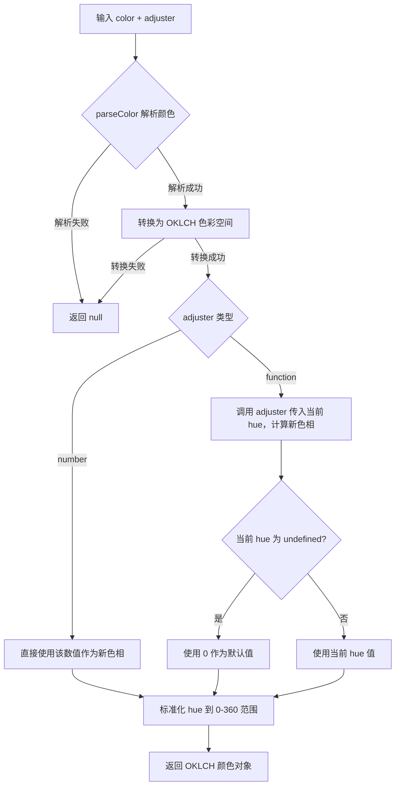

# adjustHue

以感知均匀的方式，调整任意有效颜色的色相。

该函数会先将输入颜色智能转换为 OKLCH 色彩空间，再对色相（H）通道进行操作，确保调整效果最符合人类视觉感知。支持通过数值直接设置色相，或通过函数基于当前色相进行相对调整。

## 示例

### 基本用法

```typescript
import { adjustHue } from '@esdora/color'

// 将红色色相设置为 180 度
adjustHue('#FF0000', 180)
// => { mode: 'oklch', l: 0.627..., c: 0.257..., h: 180, alpha: 1 }

// 将红色色相增加 30 度
adjustHue('#FF0000', h => h + 30)
// => { mode: 'oklch', l: 0.627..., c: 0.257..., h: 30, alpha: 1 }
```

### 色相标准化

色相值会自动标准化到 0-360 度范围内。

```typescript
import { adjustHue } from '@esdora/color'

// 超出 360 度时取模
adjustHue('#FF0000', 450) // 450 % 360 = 90
// => h ≈ 90

// 负值会转换为正角度
adjustHue('#FF0000', -30) // -30 + 360 = 330
// => h ≈ 330

// 360 度等价于 0 度
adjustHue('#FF0000', 360)
// => h ≈ 0
```

### 多种输入格式

支持 CSS 字符串、RGB 对象、HSL 字符串和 culori 颜色对象。

```typescript
import { adjustHue } from '@esdora/color'

// RGB 对象
adjustHue({ r: 255, g: 0, b: 0 }, 120)
// => h ≈ 120

// HSL 字符串
adjustHue('hsl(0, 100%, 50%)', 240)
// => h ≈ 240

// culori 颜色对象
adjustHue({ mode: 'rgb', r: 1, g: 0, b: 0 }, 60)
// => h ≈ 60
```

### 无效输入处理

当输入颜色无效或无法解析时，函数返回 `null`。

```typescript
import { adjustHue } from '@esdora/color'

adjustHue('invalid-color', 180) // => null
adjustHue('', 180) // => null
adjustHue(null as any, 180) // => null
adjustHue(undefined as any, 180) // => null
```

## 签名

```typescript
export type HueAdjuster = (currentHue: number) => number

export function adjustHue(
  color: string | EsdoraColor,
  adjuster: number | HueAdjuster
): EsdoraColor | null
```

## 参数

| 参数       | 类型                    | 描述                                                                                 | 必需 |
| ---------- | ----------------------- | ------------------------------------------------------------------------------------ | ---- |
| `color`    | `string \| EsdoraColor` | 基础颜色，支持 CSS 颜色字符串（如 `#FF0000`、`hsl(0, 100%, 50%)`）或 culori 颜色对象 | 是   |
| `adjuster` | `number \| HueAdjuster` | 色相调整器。传入数字时直接设置色相值；传入函数时基于当前色相计算新值                 | 是   |

### HueAdjuster

```typescript
type HueAdjuster = (currentHue: number) => number
```

| 参数         | 类型     | 描述                                                                   |
| ------------ | -------- | ---------------------------------------------------------------------- |
| `currentHue` | `number` | 当前颜色在 OKLCH 色彩空间中的色相值（0-360），若原颜色无色相则默认为 0 |

## 返回值

- **类型**: `EsdoraColor | null`
- **说明**: 返回调整色相后的 OKLCH 颜色对象。该对象包含 `mode: 'oklch'`、`l`（明度）、`c`（色度）、`h`（色相）等属性。
- **特殊情况**:
  - 输入颜色无效或无法解析时，返回 `null`
  - 颜色对象无法转换为 OKLCH 时，返回 `null`
  - 对于无色相的颜色（如灰色），使用函数调整器时 `currentHue` 为 0

## 运行逻辑



流程说明：函数首先尝试解析输入颜色，然后转换为 OKLCH 色彩空间以确保感知均匀性。根据 `adjuster` 的类型决定是直接设置色相还是通过回调函数计算。最终结果会经过标准化处理，确保色相值始终落在 0-360 度范围内。

## 注意事项

### 输入边界

- 色相值会自动标准化到 `[0, 360)` 范围，超出此范围的值会通过取模运算转换
- 负值色相会先加 360 的倍数，使其落入正角度范围
- 对于中性色（如灰色、白色、黑色），通常没有明确的色相定义，此时函数会将其视为色相 0 进行处理
- 当 `adjuster` 为函数时，如果原颜色无色相，`currentHue` 参数值为 0

### 错误处理

- 函数**不抛出异常**。所有错误情况均通过返回 `null` 表达
- 以下情况返回 `null`：
  - 颜色字符串无法解析（如 `'invalid-color'`、`''`）
  - 输入为 `null` 或 `undefined`
  - 颜色对象格式不合法或缺少必要字段
  - 颜色无法转换到 OKLCH 色彩空间（如包含无效 `mode` 的对象）

### 性能考虑

- **时间复杂度**: O(1) — 仅涉及单次颜色解析、转换和色相计算
- **空间复杂度**: O(1) — 返回新的颜色对象，不依赖输入数据规模

### 兼容性

- **环境要求**: ES2015+
- 依赖 `culori` 进行底层颜色空间转换

## 相关链接

- [源码](/packages/color/src/composition/adjust-hue/index.ts)
- [单元测试](/packages/color/src/composition/adjust-hue/index.test.ts)
