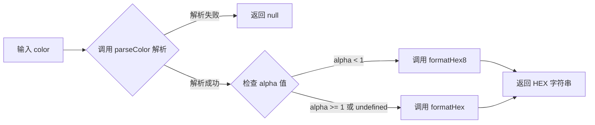

# toHex

将任意合法颜色（字符串或对象）转换为十六进制（HEX）颜色字符串。支持 RGB、HSL、OKLCH 等多种颜色格式，当颜色包含透明度时会自动使用 8 位十六进制格式（含 Alpha 通道）。

## 示例

### 基本用法

```typescript
import { toHex } from '@esdora/color'

// 从 RGB 字符串转换
toHex('rgb(255, 0, 0)') // => '#ff0000'

// 从 RGB 对象转换
toHex({ r: 255, g: 0, b: 0 }) // => '#ff0000'

// 从 HSL 字符串转换
toHex('hsl(0, 100%, 50%)') // => '#ff0000'

// 从 HSL 对象转换
toHex({ h: 0, s: 100, l: 50 }) // => '#ff0000'
```

### 不同颜色的转换

```typescript
import { toHex } from '@esdora/color'

toHex('rgb(0, 255, 0)') // => '#00ff00'（绿色）
toHex('rgb(0, 0, 255)') // => '#0000ff'（蓝色）
toHex('#ffffff') // => '#ffffff'（白色）
toHex('#000000') // => '#000000'（黑色）
```

### 带透明度的颜色

```typescript
import { toHex } from '@esdora/color'

// 半透明红色会自动使用 8 位 HEX 格式
toHex('rgba(255, 0, 0, 0.5)') // => '#ff000080'
```

### 短格式十六进制

```typescript
import { toHex } from '@esdora/color'

// 短格式会自动展开为标准 6 位
toHex('#f00') // => '#ff0000'
```

### 无效输入处理

```typescript
import { toHex } from '@esdora/color'

// 无效颜色返回 null
toHex('invalid-color') // => null
toHex('') // => null
toHex(null as any) // => null
toHex(undefined as any) // => null
```

## 签名

```typescript
function toHex(color: string | EsdoraColor): string | null
```

## 参数

| 参数    | 类型                    | 描述                                                                                                                                                                | 必需 |
| ------- | ----------------------- | ------------------------------------------------------------------------------------------------------------------------------------------------------------------- | ---- |
| `color` | `string \| EsdoraColor` | 任意合法的颜色输入，支持颜色字符串（如 `'rgb(255, 0, 0)'`、`'#ff0000'`、`'hsl(0, 100%, 50%)'`）或颜色对象（如 `{ r: 255, g: 0, b: 0 }`、`{ h: 0, s: 100, l: 50 }`） | 是   |

## 返回值

- **类型**: `string | null`
- **说明**: 以 `#` 开头的十六进制颜色字符串。如果输入颜色包含透明度（alpha < 1），则返回 8 位 HEX 格式（如 `#ff000080`）；否则返回 6 位 HEX 格式（如 `#ff0000`）。
- **特殊情况**:
  - 输入无效颜色字符串、空字符串、`null` 或 `undefined` 时，返回 `null`
  - 短格式 HEX（如 `#f00`）会自动展开为 6 位格式（`#ff0000`）
  - 完全透明的颜色会返回带 Alpha 通道的 8 位 HEX 格式

## 运行逻辑



函数首先通过 `parseColor` 将输入归一化为内部标准颜色对象。`parseColor` 会智能识别开发者习惯的格式（如 `{ r: 255, g: 0, b: 0 }` 或 `{ h: 0, s: 100, l: 50 }`）并自动转换为 culori 兼容格式。解析成功后，根据透明度决定使用 6 位或 8 位 HEX 输出格式。

## 注意事项

### 输入边界

- 支持的颜色字符串格式：`rgb(...)`、`rgba(...)`、`hsl(...)`、`#rrggbb`、`#rgb`、`#rrggbbaa` 等 culori 支持的所有格式
- RGB 对象中 `r`、`g`、`b` 值范围为 `0-255`，函数会自动检测并归一化到 `0-1`
- HSL 对象中 `s`、`l` 值范围为 `0-100`，函数会自动检测并归一化到 `0-1`
- 如果对象中已包含 `mode` 字段（如 `{ mode: 'rgb', r: 1, g: 0, b: 0 }`），则视为 culori 标准对象，不再进行范围转换

### 错误处理

- 函数不会抛出异常，所有无效输入均返回 `null`
- 建议在使用返回值前进行非空检查

### 性能考虑

- **时间复杂度**: O(1) — 纯转换操作，不涉及遍历或递归
- **空间复杂度**: O(1) — 仅创建少量中间对象

## 相关链接

- [源码](https://github.com/kkfive/esdora/blob/main/packages/color/src/conversion/to-hex/index.ts)
- [单元测试](https://github.com/kkfive/esdora/blob/main/packages/color/src/conversion/to-hex/index.test.ts)
