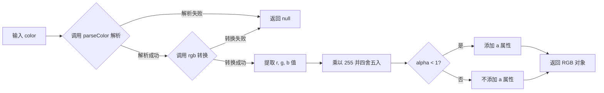

# toRgb

将任意合法颜色（字符串或对象）转换为 RGB 颜色对象。支持 HEX、RGB、HSL、OKLCH 等多种颜色格式，当颜色包含透明度时会在结果中添加 `a` 属性。

## 示例

### 基本用法

```typescript
import { toRgb } from '@esdora/color'

// 从 HEX 字符串转换
toRgb('#FF0000') // => { r: 255, g: 0, b: 0 }

// 从 RGB 字符串转换
toRgb('rgb(255, 0, 0)') // => { r: 255, g: 0, b: 0 }

// 从 HSL 字符串转换
toRgb('hsl(0, 100%, 50%)') // => { r: 255, g: 0, b: 0 }

// 从 HSL 对象转换
toRgb({ h: 0, s: 100, l: 50, mode: 'hsl' }) // => { r: 255, g: 0, b: 0 }
```

### 不同颜色的转换

```typescript
import { toRgb } from '@esdora/color'

toRgb('#00FF00') // => { r: 0, g: 255, b: 0 }（绿色）
toRgb('#0000FF') // => { r: 0, g: 0, b: 255 }（蓝色）
toRgb('#FFFFFF') // => { r: 255, g: 255, b: 255 }（白色）
toRgb('#000000') // => { r: 0, g: 0, b: 0 }（黑色）
```

### 带透明度的颜色

```typescript
import { toRgb } from '@esdora/color'

// 半透明红色会包含 a 属性
toRgb('rgba(255, 0, 0, 0.5)') // => { r: 255, g: 0, b: 0, a: 0.5 }
```

### 短格式十六进制

```typescript
import { toRgb } from '@esdora/color'

// 短格式 HEX 自动展开
toRgb('#f00') // => { r: 255, g: 0, b: 0 }
```

### 无效输入处理

```typescript
import { toRgb } from '@esdora/color'

// 无效颜色返回 null
toRgb('invalid-color') // => null
toRgb('') // => null
toRgb(null as any) // => null
```

## 签名

```typescript
function toRgb(color: string | EsdoraColor): EsdoraRgbColor | null
```

## 参数

| 参数    | 类型                    | 描述                                                                                                                                                                             | 必需 |
| ------- | ----------------------- | -------------------------------------------------------------------------------------------------------------------------------------------------------------------------------- | ---- |
| `color` | `string \| EsdoraColor` | 任意合法的颜色输入，支持颜色字符串（如 `'rgb(255, 0, 0)'`、`'#FF0000'`、`'hsl(0, 100%, 50%)'`）或颜色对象（如 `{ r: 255, g: 0, b: 0 }`、`{ h: 0, s: 100, l: 50, mode: 'hsl' }`） | 是   |

## 返回值

- **类型**: `EsdoraRgbColor | null`
- **说明**: 一个包含 `r`、`g`、`b` 属性的 RGB 颜色对象。`r`、`g`、`b` 值范围为 `0-255`。如果输入颜色包含透明度（alpha < 1），则结果会额外包含 `a` 属性，范围为 `0-1`。
- **特殊情况**:
  - 输入无效颜色字符串、空字符串、`null` 或 `undefined` 时，返回 `null`
  - 当 alpha 值为 `1` 或 `undefined` 时，结果中**不会**包含 `a` 属性
  - 当 RGB 通道值为 `undefined` 时，默认使用 `0`

## 运行逻辑



函数首先通过 `parseColor` 将输入归一化为内部标准颜色对象。`parseColor` 会智能识别开发者习惯的格式（如 `{ r: 255, g: 0, b: 0 }` 或 `{ h: 0, s: 100, l: 50 }`）并自动转换为 culori 兼容格式。解析成功后，调用 `rgb` 函数转换为 RGB 空间，最后将归一化到 `0-1` 的通道值乘以 `255` 并四舍五入，得到标准的 `0-255` 范围结果。

## 注意事项

### 输入边界

- 支持的颜色字符串格式：`rgb(...)`、`rgba(...)`、`hsl(...)`、`#rrggbb`、`#rgb`、`#rrggbbaa` 等 culori 支持的所有格式
- RGB 对象中 `r`、`g`、`b` 值范围为 `0-255`，函数会自动检测并归一化到 `0-1`
- HSL 对象中 `s`、`l` 值范围为 `0-100`，函数会自动检测并归一化到 `0-1`
- 如果对象中已包含 `mode` 字段（如 `{ mode: 'rgb', r: 1, g: 0, b: 0 }`），则视为 culori 标准对象，不再进行范围转换

### 错误处理

- 函数不会抛出异常，所有无效输入均返回 `null`
- `rgb` 转换过程中若发生异常（如颜色模式无效），也会捕获并返回 `null`
- 建议在使用返回值前进行非空检查

### 性能考虑

- **时间复杂度**: O(1) — 纯转换操作，不涉及遍历或递归
- **空间复杂度**: O(1) — 仅创建少量中间对象

## 相关链接

- [源码](https://github.com/kkfive/esdora/blob/main/packages/color/src/conversion/to-rgb/index.ts)
- [单元测试](https://github.com/kkfive/esdora/blob/main/packages/color/src/conversion/to-rgb/index.test.ts)
