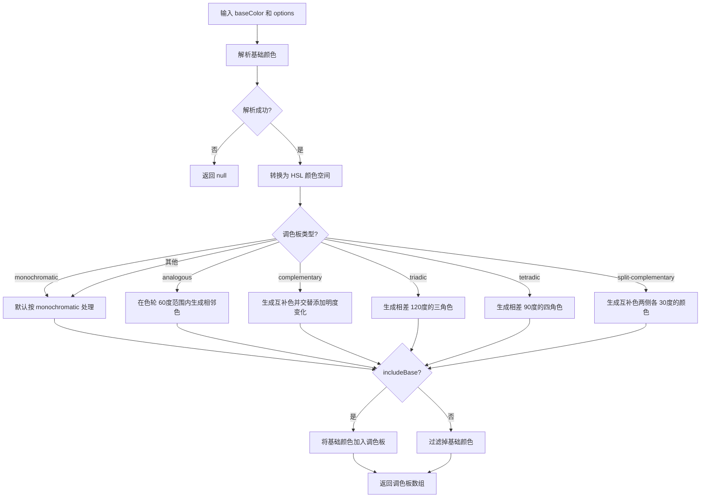

# generatePalette

基于基础颜色生成和谐调色板，支持多种色彩理论模式（单色调、类似色、互补色、三角色、四角色、分裂互补色）。

## 示例

### 基本用法

```typescript
import { generatePalette } from '@esdora/color'

// 使用默认参数生成单色调色板
generatePalette('#3498db')
// => ['#151515', '#3e3e3e', '#676767', '#909090', '#3498db']

// 生成指定数量的单色调色板
generatePalette('#3498db', { type: 'monochromatic', count: 5 })
// => ['#151515', '#3e3e3e', '#676767', '#909090', '#3498db']

// 生成类似色调色板
generatePalette('#ff6b6b', { type: 'analogous', count: 3 })
// => ['#ff4343', '#ff6b6b', '#ff9494']

// 生成互补色调色板
generatePalette('#ff0000', { type: 'complementary' })
// => ['#ff0000', '#00ffff', '#ff2a2a', '#00d4d4', '#ff5454']

// 生成三角色调色板
generatePalette('#ff0000', { type: 'triadic' })
// => ['#ff0000', '#00ff00', '#0000ff']

// 生成四角色调色板
generatePalette('#9b59b6', { type: 'tetradic' })
// => ['#9b59b6', '#59b69a', '#b6a059', '#b65976']

// 生成分裂互补色调色板
generatePalette('#ff0000', { type: 'split-complementary' })
// => ['#ff0000', '#00ff80', '#0080ff']
```

### 排除基础颜色

```typescript
import { generatePalette } from '@esdora/color'

// 不包含基础颜色
generatePalette('#3498db', { type: 'monochromatic', count: 5, includeBase: false })
// => ['#151515', '#3e3e3e', '#676767', '#909090', '#b9b9b9']

// 三角色调色板排除基础颜色
generatePalette('#ff0000', { type: 'triadic', includeBase: false })
// => ['#00ff00', '#0000ff']
```

### 处理无效输入

```typescript
import { generatePalette } from '@esdora/color'

// 无效颜色字符串
generatePalette('invalid-color')
// => null

// 空字符串
generatePalette('')
// => null

// null 输入
generatePalette(null as any)
// => null
```

## 签名

```typescript
export interface PaletteOptions {
  /** 生成的颜色数量，默认为 5 */
  count?: number
  /** 调色板类型 */
  type?: 'monochromatic' | 'analogous' | 'complementary' | 'triadic' | 'tetradic' | 'split-complementary'
  /** 是否包含基础颜色，默认为 true */
  includeBase?: boolean
}

export function generatePalette(
  baseColor: string | EsdoraColor,
  options?: PaletteOptions
): string[] | null
```

## 参数

| 参数        | 类型                    | 描述                                          | 必需 |
| ----------- | ----------------------- | --------------------------------------------- | ---- |
| `baseColor` | `string \| EsdoraColor` | 基础颜色，支持 hex、rgb、hsl 等格式或颜色对象 | 是   |
| `options`   | `PaletteOptions`        | 调色板生成选项                                | 否   |

### PaletteOptions

| 字段          | 类型                                                                                                    | 描述             | 默认值            |
| ------------- | ------------------------------------------------------------------------------------------------------- | ---------------- | ----------------- |
| `count`       | `number`                                                                                                | 生成的颜色数量   | `5`               |
| `type`        | `'monochromatic' \| 'analogous' \| 'complementary' \| 'triadic' \| 'tetradic' \| 'split-complementary'` | 调色板类型       | `'monochromatic'` |
| `includeBase` | `boolean`                                                                                               | 是否包含基础颜色 | `true`            |

## 返回值

- **类型**: `string[] | null`
- **说明**: 生成的调色板颜色数组，所有颜色均为十六进制格式（`#RRGGBB`）。当输入颜色无效时返回 `null`。
- **特殊情况**:
  - 输入为无效颜色字符串、空字符串或 `null` 时返回 `null`
  - `monochromatic` 模式下，若 `includeBase` 为 `true` 且基础颜色不在生成的颜色中，会将基础颜色插入并按亮度排序，最终仍截断至 `count` 个
  - `analogous` 模式下，若 `includeBase` 为 `false`，返回的颜色数量可能少于 `count`
  - `triadic`、`tetradic`、`split-complementary` 模式的固定颜色数量分别为 3、4、3，不受 `count` 参数影响

## 运行逻辑



函数首先将输入颜色解析为内部颜色对象，然后转换为 HSL 色彩空间。根据指定的 `type` 选择对应的生成算法，每种算法基于色彩理论在色轮上计算色相、饱和度或明度的变化。生成完成后，根据 `includeBase` 决定是否保留基础颜色，最终返回十六进制格式的颜色数组。

## 注意事项

### 输入边界

- `baseColor` 支持 hex（如 `#3498db`）、rgb（如 `rgb(255, 107, 107)`）、hsl（如 `hsl(0, 70%, 60%)`）等标准 CSS 颜色格式，也支持 `EsdoraColor` 对象
- 当 `baseColor` 为 `EsdoraColor` 对象且 HSL 分量为 `undefined` 时，函数会使用默认值（`h: 0`、`s: 0`、`l: 0`）继续处理，不会抛出异常
- `count` 参数仅在 `monochromatic`、`analogous`、`complementary` 模式下生效；`triadic`、`tetradic`、`split-complementary` 模式有固定的颜色数量
- 无效的 `type` 值会被回退到 `monochromatic` 处理

### 错误处理

- 函数不会抛出异常。对于无效输入（无效颜色字符串、空字符串、`null` 等），返回 `null`
- HSL 分量为 `undefined` 时通过 `?? 0` 回退到默认值，确保生成流程不中断

### 性能考虑

- **时间复杂度**: `O(n)` — 其中 `n` 为 `count`，主要开销为循环生成颜色和可能的排序操作
- **空间复杂度**: `O(n)` — 生成的调色板数组占用线性空间

### 兼容性

- **环境要求**: 依赖 `culori` 进行颜色格式转换，适用于所有支持 ES2015+ 的运行时

## 相关链接

- [源码](/packages/color/src/generation/generate-palette/index.ts)
- [单元测试](/packages/color/src/generation/generate-palette/index.test.ts)
