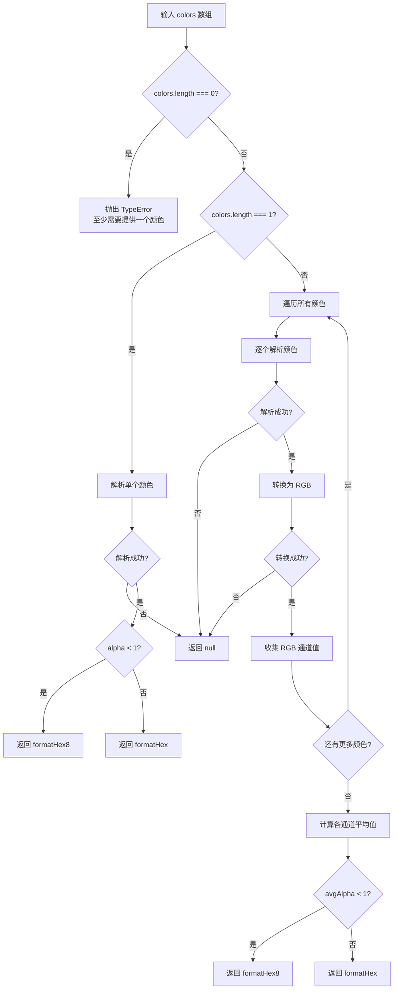

# mix

混合多个颜色，创建一个新的颜色。

在 RGB 色彩空间中对所有输入颜色进行平均计算，返回十六进制格式的颜色字符串。支持任意数量的颜色输入，包括 Hex、RGB、RGBA、HSL 等格式，也支持 EsdoraColor 对象。

## 示例

### 基本用法

```typescript
import { mix } from '@esdora/color'

// 混合两个颜色
mix('#ff0000', '#0000ff') // => '#800080'

// 混合三个颜色
mix('#ff0000', '#00ff00', '#0000ff') // => '#555555'

// 混合四个颜色
mix('#ff0000', '#00ff00', '#0000ff', '#ffff00') // => '#808040'
```

### 不同颜色格式的混合

```typescript
import { mix } from '@esdora/color'

// RGB 字符串与 Hex 混合
mix('#ff0000', 'rgb(0, 255, 0)') // => '#808000'

// HSL 字符串混合
mix('hsl(0, 100%, 50%)', 'hsl(120, 100%, 50%)') // => '#808000'
```

### 带透明度的颜色混合

```typescript
import { mix } from '@esdora/color'

// 两个带透明度的颜色混合，返回 8 位 Hex
mix('rgba(255, 0, 0, 0.8)', 'rgba(0, 255, 0, 0.4)') // => '#80800099'

// 多个带透明度的颜色混合
mix('rgba(255, 0, 0, 1)', 'rgba(0, 255, 0, 0.5)', 'rgba(0, 0, 255, 0)') // => '#55555580'
```

### 边界情况

```typescript
import { mix } from '@esdora/color'

// 单个颜色输入，返回自身
mix('#ff0000') // => '#ff0000'

// 相同颜色多次混合，结果不变
mix('#ff0000', '#ff0000', '#ff0000') // => '#ff0000'

// 白色和黑色混合得到灰色
mix('#ffffff', '#000000') // => '#808080'
```

## 签名

```typescript
function mix(...colors: (string | EsdoraColor)[]): string | null
```

## 参数

| 参数     | 类型                        | 描述                               | 必需 |
| -------- | --------------------------- | ---------------------------------- | ---- |
| `colors` | `(string \| EsdoraColor)[]` | 要混合的颜色数组，至少需要一个颜色 | 是   |

## 返回值

- **类型**: `string \| null`
- **说明**: 混合后的十六进制颜色字符串。当所有颜色完全不透明时返回 6 位 Hex（如 `#808000`），当存在透明度时返回 8 位 Hex（如 `#80800099`）。
- **特殊情况**:
  - 输入单个颜色时，直接返回该颜色格式化后的 Hex 字符串
  - 任意一个颜色解析失败或转换为 RGB 失败时，返回 `null`
  - 无参数调用时抛出 `TypeError`

## 运行逻辑



函数首先检查输入参数数量。对于零个参数直接抛出异常；对于单个参数则解析后格式化返回。对于多个颜色，逐个解析并转换为 RGB 格式，然后对 R、G、B、Alpha 四个通道分别求平均值，最后根据平均透明度决定返回 6 位还是 8 位 Hex 字符串。

## 注意事项

### 输入边界

- 至少需要提供一个颜色，否则抛出 `TypeError`
- 支持的颜色格式包括 Hex、RGB、RGBA、HSL 以及 EsdoraColor 对象
- 当 RGB 颜色对象的通道值为 `undefined` 时，会默认使用 0（透明度默认 1）
- 混合算法在 RGB 色彩空间中进行简单平均，不考虑色彩空间的感知均匀性

### 错误处理

- 无参数调用时抛出 `TypeError`，提示 "至少需要提供一个颜色"
- 任意一个颜色解析失败时返回 `null`，不会抛出异常
- 颜色对象模式无效导致 RGB 转换失败时返回 `null`
- `null` 或非法类型作为输入时返回 `null`

### 性能考虑

- **时间复杂度**: O(n) — n 为颜色数量，需要遍历所有颜色进行解析和转换
- **空间复杂度**: O(n) — 需要存储每个颜色的 RGB 表示用于后续平均计算

## 相关链接

- [源码](https://github.com/kkfive/esdora/blob/main/packages/color/src/manipulation/mix/index.ts)
- [单元测试](https://github.com/kkfive/esdora/blob/main/packages/color/src/manipulation/mix/index.test.ts)
