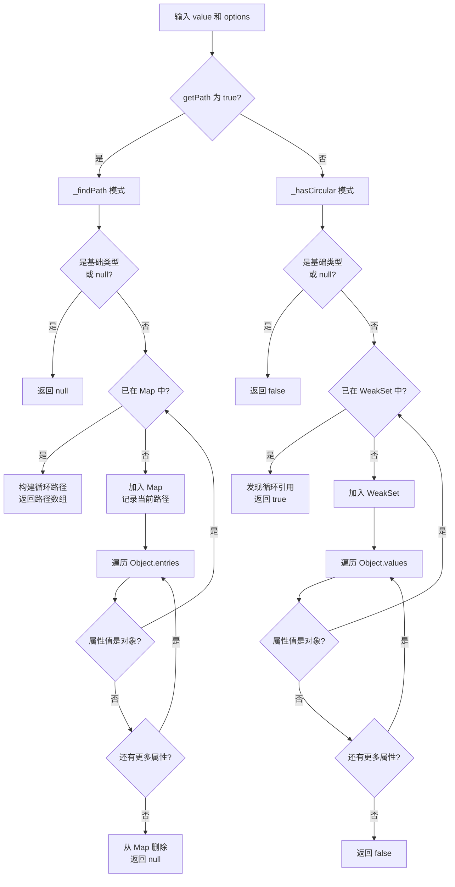

# isCircular

检测一个值（通常是对象或数组）中是否存在循环引用，并可选择性地返回第一个检测到的循环路径。

## 示例

### 基本用法

```typescript
import { isCircular } from '@esdora/kit'

// 无循环引用的对象
isCircular({ a: 1, b: { c: 2 } }) // => false

// 存在循环引用
const obj: any = { a: 1 }
obj.self = obj
isCircular(obj) // => true
```

### 路径查找模式

```typescript
import { isCircular } from '@esdora/kit'

// 获取循环引用的路径
const obj: any = {
  a: {
    b: {
      c: {},
    },
  },
}
obj.a.b.c.ref = obj

isCircular(obj, { getPath: true })
// => ['a', 'b', 'c', 'ref', "[Circular Reference -> 'root']"]
```

### 复杂循环引用

```typescript
import { isCircular } from '@esdora/kit'

// 两个对象相互引用
const obj1: any = { name: 'obj1' }
const obj2: any = { name: 'obj2' }
obj1.ref = obj2
obj2.ref = obj1

isCircular(obj1) // => true

// 深层嵌套中的循环引用
const nested: any = {
  level1: {
    level2: {
      level3: {},
    },
  },
}
nested.level1.level2.level3.back = nested.level1

isCircular(nested, { getPath: true })
// => ['level1', 'level2', 'level3', 'back', "[Circular Reference -> 'level1']"]
```

### 基础类型输入

```typescript
import { isCircular } from '@esdora/kit'

isCircular(null) // => false
isCircular('hello') // => false
isCircular(42) // => false
isCircular(undefined) // => false
```

## 签名

```typescript
// 路径查找模式
export function isCircular(value: unknown, options: { getPath: true }): string[] | null

// 布尔检查模式（显式）
export function isCircular(value: unknown, options?: { getPath: false }): boolean

// 布尔检查模式（默认）
export function isCircular(value: unknown): boolean

// 通用签名
export function isCircular(value: unknown, options?: { getPath: boolean }): boolean | string[] | null
```

## 参数

| 参数      | 类型                    | 描述                                   | 必需 |
| --------- | ----------------------- | -------------------------------------- | ---- |
| `value`   | `unknown`               | 要检查的值，可以是任何 JavaScript 类型 | 是   |
| `options` | `{ getPath?: boolean }` | 配置对象，用于控制函数行为             | 否   |

### Options

| 字段      | 类型      | 描述                                                          | 默认值  |
| --------- | --------- | ------------------------------------------------------------- | ------- |
| `getPath` | `boolean` | 是否启用路径查找模式。`true` 返回路径数组，`false` 返回布尔值 | `false` |

## 返回值

- **类型**: `boolean | string[] | null`
- **说明**:
  - 当 `getPath` 为 `false` 或未提供时，返回 `boolean`：`true` 表示存在循环引用，`false` 表示不存在
  - 当 `getPath` 为 `true` 时，返回 `string[] | null`：存在循环引用时返回路径数组，否则返回 `null`
- **特殊情况**:
  - 输入为基础类型（`null`、`undefined`、字符串、数字、布尔值、`Symbol`、`BigInt`）时，始终返回 `false`（布尔模式）或 `null`（路径模式）
  - 路径数组的最后一个元素格式为 `"[Circular Reference -> 'path']"`，其中 `path` 是首次遇到该对象的路径，`'root'` 表示根对象

## 运行逻辑

`isCircular` 提供两种内部实现，根据 `options.getPath` 自动切换：



布尔检查模式使用 `WeakSet` 追踪已访问对象，内存开销小且性能更高；路径查找模式使用 `Map` 记录每个对象的路径信息，以便在发现循环时回溯路径。

## 注意事项

### 输入边界

- 基础类型（`null`、`undefined`、字符串、数字、布尔值、`Symbol`、`BigInt`）始终被视为无循环引用
- `Date`、`RegExp`、函数对象会被遍历但不会被视为循环引用（除非被显式设置引用）
- 空对象 `{}` 和空数组 `[]` 返回 `false`
- 对象属性的遍历顺序遵循 `Object.entries()` 的顺序，多个循环路径时返回第一个发现的

### 错误处理

- 函数**不会抛出异常**，对所有输入类型都有定义的行为
- 对于不可遍历的值（基础类型），直接返回安全的默认值

### 性能考虑

- **时间复杂度**: `O(n)` — `n` 为对象中所有可遍历属性的总数，每个对象/属性只访问一次
- **空间复杂度**:
  - 布尔模式: `O(d)` — `d` 为对象嵌套深度，`WeakSet` 只存储对象引用
  - 路径模式: `O(d * p)` — 额外存储每个对象的路径数组，`Map` 开销更大
- 布尔模式比路径模式性能更高，推荐在仅需判断是否存在循环引用时使用
- 处理深度嵌套对象（如 100+ 层）时性能良好，不会栈溢出

### 兼容性

- **环境要求**: ES2015+（依赖 `WeakSet` 和 `Map`）
- 所有现代浏览器和 Node.js 环境均支持

## 相关链接

- [源码](https://github.com/kkfive/esdora/blob/main/packages/kit/src/is/is-circular/index.ts)
- [单元测试](https://github.com/kkfive/esdora/blob/main/packages/kit/src/is/is-circular/index.test.ts)
