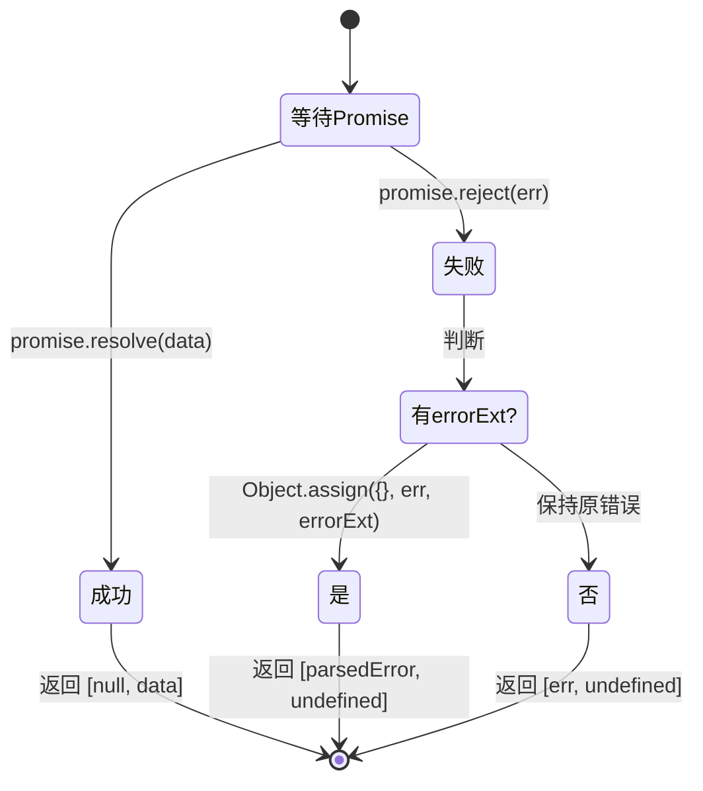

# to

将 Promise 转换为一个元组 `[error, data]`，让你可以用解构替代 `try/catch` 来处理异步错误。

## 示例

### 基本用法 — 成功场景

```typescript
import { to } from '@esdora/kit'

const promise = Promise.resolve(41)

const [err, data] = await to(promise)
// => [null, 41]
```

### 基本用法 — 失败场景

```typescript
import { to } from '@esdora/kit'

// eslint-disable-next-line prefer-promise-reject-errors
const promise = Promise.reject('Error')

const [err, data] = await to(promise)
// => ['Error', undefined]
```

### 为错误对象附加额外信息

```typescript
import { to } from '@esdora/kit'

// eslint-disable-next-line prefer-promise-reject-errors
const promise = Promise.reject({ error: 'Error message' })

const [err] = await to(promise, { extraKey: 1 })
// => [{ error: 'Error message', extraKey: 1 }, undefined]
```

### 显式指定泛型类型

```typescript
import { to } from '@esdora/kit'

const [_, user] = await to<{ name: string }>(Promise.resolve({ name: '123' }))
// => [null, { name: '123' }]
```

## 签名

```typescript
function to<T, U = Error>(
  promise: Promise<T>,
  errorExt?: object,
): Promise<[U, undefined] | [null, T]>
```

## 参数

| 参数       | 类型         | 描述                             | 必需 |
| ---------- | ------------ | -------------------------------- | ---- |
| `promise`  | `Promise<T>` | 要包装的 Promise 实例            | 是   |
| `errorExt` | `object`     | 可选，合并到错误对象上的额外属性 | 否   |

## 返回值

- **类型**: `Promise<[U, undefined] | [null, T]>`
- **说明**: 始终 resolve 为一个元组。第一个元素是错误，第二个元素是数据。
- **特殊情况**:
  - Promise resolve 时返回 `[null, data]`
  - Promise reject 时返回 `[error, undefined]`
  - 如果传入了 `errorExt`，错误对象会与 `errorExt` 浅合并

## 运行逻辑



`to` 的核心思想是**将异常状态正常化**：无论 Promise 是成功还是失败，返回的 Promise 始终 resolve，永远不会 reject。这样调用方就不需要 `try/catch`，而是通过解构元组来判断结果。

## 注意事项

### 输入边界

- `promise` 必须是有效的 Promise 实例（或 thenable）
- `errorExt` 为可选参数，不传时错误对象原样返回
- 当 `errorExt` 传入时，会执行浅合并（`Object.assign`），不会深拷贝嵌套对象

### 错误处理

- 本函数**不会抛出异常**，它内部通过 `.catch` 捕获 Promise 的 reject，并将错误放入元组第一个位置
- 返回的 Promise 始终 resolve，不会 reject
- 如果原 Promise reject 的值不是对象类型（如字符串、数字），`errorExt` 的合并行为会将其包装为对象

## 相关链接

- [源码](https://github.com/kkfive/esdora/blob/main/packages/kit/src/promise/to/index.ts)
- [单元测试](https://github.com/kkfive/esdora/blob/main/packages/kit/src/promise/to/index.test.ts)
