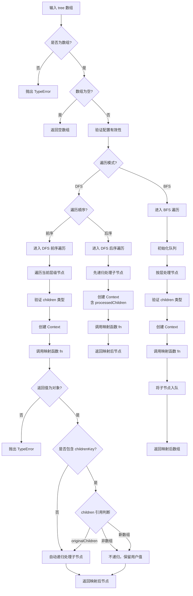

# treeMap

对树形数组进行深度优先（DFS）或广度优先（BFS）遍历，并对每个节点应用映射函数，返回新的树形数组。

## 示例

### 基本用法

```typescript
import { treeMap } from '@esdora/kit'

const tree = [
  { id: 1, children: [{ id: 2 }, { id: 3 }] },
  { id: 4, children: [{ id: 5 }] },
]

treeMap(tree, item => ({ ...item, id: item.id * 2 }))
// => [
//   { id: 2, children: [{ id: 4 }, { id: 6 }] },
//   { id: 8, children: [{ id: 10 }] },
// ]
```

### 使用 Context 解决条件性 children 问题

```typescript
import { treeMap } from '@esdora/kit'

const tree = [
  { id: 1, children: [{ id: 2 }] },
  { id: 3, children: [] },
]

treeMap(tree, (item, ctx) => ({
  ...item,
  children: item.children?.length > 0 ? ctx?.originalChildren : null,
}))
// => [
//   { id: 1, children: [{ id: 2, children: null }] },
//   { id: 3, children: null },
// ]
```

### 启用 depth 字段

```typescript
import { treeMap } from '@esdora/kit'

const tree = [
  { id: 1, children: [{ id: 2 }, { id: 3, children: [{ id: 4 }] }] },
]

const depths: number[] = []
treeMap(tree, (item, ctx) => {
  if (ctx?.depth !== undefined)
    depths.push(ctx.depth)
  return item
}, {
  context: { depth: true },
})
// depths => [0, 1, 1, 2]
```

### 后序遍历聚合

```typescript
import { treeMap } from '@esdora/kit'

interface Node {
  id: number
  value: number
  totalValue?: number
  children?: Node[]
}

const tree: Node[] = [
  {
    id: 1,
    value: 10,
    children: [
      { id: 2, value: 20 },
      { id: 3, value: 30, children: [{ id: 4, value: 40 }] },
    ],
  },
]

treeMap(tree, (item, ctx) => {
  const childSum = ctx?.processedChildren?.reduce((sum, c) => sum + (c.totalValue ?? 0), 0) ?? 0
  return {
    ...item,
    totalValue: item.value + childSum,
    children: ctx?.processedChildren,
  }
}, {
  order: 'post',
  context: { processedChildren: true },
})
// => [{ id: 1, value: 10, totalValue: 100, children: [
//      { id: 2, value: 20, totalValue: 20 },
//      { id: 3, value: 30, totalValue: 70, children: [{ id: 4, value: 40, totalValue: 40 }] },
//    ]}]
```

### 自定义 childrenKey

```typescript
import { treeMap } from '@esdora/kit'

const tree = [
  { id: 1, subItems: [{ id: 2 }, { id: 3 }] },
  { id: 4, subItems: [{ id: 5 }] },
]

treeMap(tree, item => ({ ...item, id: item.id * 2 }), {
  childrenKey: 'subItems',
})
// => [
//   { id: 2, subItems: [{ id: 4 }, { id: 6 }] },
//   { id: 8, subItems: [{ id: 10 }] },
// ]
```

## 签名

```typescript
export function treeMap<
  T extends Record<string, any>,
  U extends Record<string, any> | null | undefined,
  Config extends TreeMapContextConfig = Record<string, never>,
>(
  array: T[],
  fn: (item: T, context?: TreeMapContext<T, Config>) => U,
  options?: TreeMapOptions<Config>,
): U[]
```

## 参数

| 参数      | 类型                                                  | 描述                     | 必需 |
| --------- | ----------------------------------------------------- | ------------------------ | ---- |
| `array`   | `T[]`                                                 | 输入的树形数组           | 是   |
| `fn`      | `(item: T, context?: TreeMapContext<T, Config>) => U` | 映射函数，对每个节点调用 | 是   |
| `options` | `TreeMapOptions<Config>`                              | 遍历选项                 | 否   |

### TreeMapOptions

| 字段          | 类型                                             | 描述                                             | 默认值       |
| ------------- | ------------------------------------------------ | ------------------------------------------------ | ------------ |
| `mode`        | `'dfs' \| 'bfs'`                                 | 遍历模式：深度优先或广度优先                     | `'dfs'`      |
| `order`       | `'pre' \| 'post'`                                | 遍历顺序：前序或后序，仅在 `dfs` 模式下有效      | `'pre'`      |
| `childrenKey` | `string`                                         | 子节点属性的键名                                 | `'children'` |
| `context`     | `Config`                                         | Context 配置（按需启用字段）                     | —            |
| `getNodeId`   | `(node: any, index: number) => string \| number` | 自定义节点标识符提取函数，仅在启用 `path` 时需要 | —            |

### TreeMapContextConfig

| 字段                | 类型      | 描述                                                     |
| ------------------- | --------- | -------------------------------------------------------- |
| `depth`             | `boolean` | 是否包含 depth 信息（节点深度，根节点为 0）              |
| `index`             | `boolean` | 是否包含 index 信息（同级节点索引，从 0 开始）           |
| `parent`            | `boolean` | 是否包含 parent 引用（根节点为 undefined）               |
| `path`              | `boolean` | 是否包含 path 信息（从根节点到当前节点的路径）           |
| `isLeaf`            | `boolean` | 是否包含 isLeaf 标识（是否叶子节点）                     |
| `isRoot`            | `boolean` | 是否包含 isRoot 标识（是否根节点）                       |
| `processedChildren` | `boolean` | 是否包含 processedChildren（已处理的子节点，仅后序遍历） |

## 返回值

- **类型**: `U[]`
- **说明**: 映射后的新树形数组，结构与输入数组一致，但每个节点经过映射函数转换
- **特殊情况**:
  - 输入空数组时返回空数组 `[]`
  - 映射函数返回 `null` 或 `undefined` 时，该位置保留原值
  - 映射函数返回的对象中若未包含 `childrenKey`，函数会自动递归处理子节点
  - 映射函数返回的对象中若包含 `childrenKey` 且值为 `null`/`undefined`/非数组，则不会递归处理子节点
  - 映射函数返回 `ctx.originalChildren` 时，会保留原始引用并递归处理子节点

### 泛型约束

- `T extends Record<string, any>` — 输入节点必须是对象类型
- `U extends Record<string, any> | null | undefined` — 映射函数必须返回对象类型、null 或 undefined，不支持返回原始类型（如 number、string、boolean）
- `Config extends TreeMapContextConfig` — Context 配置必须符合 `TreeMapContextConfig` 接口

## 运行逻辑



函数根据 `mode` 和 `order` 选择三种遍历策略之一：

- **DFS 前序（默认）**：先对当前节点应用映射函数，再递归处理子节点
- **DFS 后序**：先递归处理子节点，再对当前节点应用映射函数，支持 `processedChildren`
- **BFS**：使用队列按层处理节点，索引代替 `shift()` 实现 O(1) 出队

## 注意事项

### 输入边界

- 输入必须是数组，否则抛出 `TypeError`
- 节点的 `children` 属性（或自定义 `childrenKey`）必须是数组、`undefined`、`null` 或不存在，否则抛出 `TypeError`
- 空数组输入返回空数组，不调用映射函数
- 空 `children` 数组（`[]`）会被保留

### 错误处理

- **输入类型错误**：非数组输入时抛出 `TypeError('Expected an array as the first argument')`
- **children 类型错误**：`children` 为非数组对象时抛出 `TypeError`，错误信息包含节点 `id`/`name` 和实际类型
- **返回值类型错误**：映射函数返回原始类型（number、string、boolean 等）时抛出 `TypeError('Mapping function must return an object, null, or undefined')`
- **配置错误**：在 BFS 模式或前序遍历中启用 `processedChildren` 时抛出 `Error`
- 映射函数自身抛出的异常会直接向上传播

### 性能考虑

- **时间复杂度**: `O(n)` — n 为树中节点总数，每个节点访问一次
- **空间复杂度**: `O(h)`（DFS）/ `O(w)`（BFS）— h 为树高度，w 为最大层宽
- BFS 使用索引代替 `shift()` 避免 O(n) 的数组头出队开销
- 递归深度受 JavaScript 调用栈限制，实测可处理约 1000 层嵌套
- Context 对象按需创建，未启用配置时为零开销

### 兼容性

- **环境要求**: ES2015+（使用 `Object.freeze`、`Array.isArray`、`Object.prototype.hasOwnProperty.call`）
- **TypeScript**: 4.5+（条件类型推断）

## 相关链接

- [源码](https://github.com/DreamyTZK/esdora/blob/main/packages/kit/src/tree/map/index.ts)
- [单元测试](https://github.com/DreamyTZK/esdora/blob/main/packages/kit/src/tree/map/index.test.ts)
